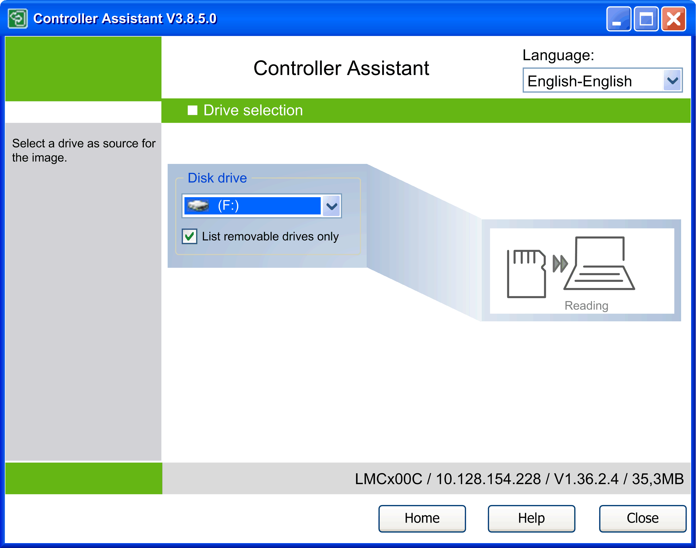
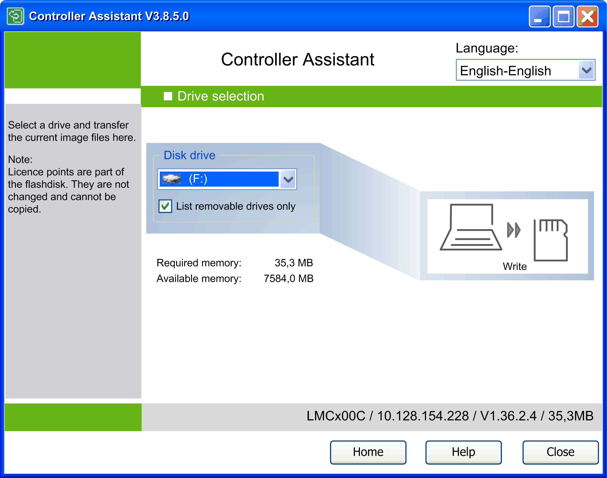

# Description of the Drive selection Dialog

## Overview

To open the dialog Drive selection, click one of the buttons Read from... or Write to... on the Manage images dialog. Depending on this selection, the Drive selection dialog appears in one of the variants described in this chapter.

## Read from...

Drive selection dialog after call-up via Read from... button.

In this dialog, select the drive into which you have inserted the removable storage device (CF card for PacDrive M controllers, SD card for Modicon M221, M241, M251 Logic Controllers, or USB mass storage device for Modicon M258 Logic Controller, Modicon LMC058 Motion Controller).

By default, the option List removable drives only is selected. This has the effect that the Disk drive list only contains drives of removable media. To display also hard disk drives in the list, deselect the option List removable drives only.

Select a drive from the Disk drive list.

Click the Reading button to load the image into the Controller Assistant.

## Write to...

NOTE: Writing, for example on a EcoStruxure Machine Expert/EcoStruxure Automation Expert - Motion controller card, is only possible if the inserted storage device has a data volume of at least 128 Mbyte.

Drive selection dialog after call-up via Write to... button.

In this dialog, select the drive into which you have inserted the storage device.

By default, the option List removable drives only is selected. This has the effect that the Disk drive list only contains drives of removable media. To display also hard disk drives in the list, deselect the option List removable drives only.

Click the Write button to write the image back onto the inserted storage device. Before the operation is performed, a message is displayed informing you that the data will be deleted from the selected drive. Before you start the operation by clicking Yes, it allows you to verify the content of the destination drive in a Windows Explorer view by clicking Explorer. To cancel the operation, click No.

For PacDrive controllers (except for PacDrive M controllers), you might be prompted for [device user rights management](D-SE-0104135.html#D-SE-0104135).

Note for PacDrive M controllers that existing license points are not a component part of an image but are a part of a flash disk. They cannot be copied. They are not changed when writing an image to the flash disk or controller.

EIO0000001671.07