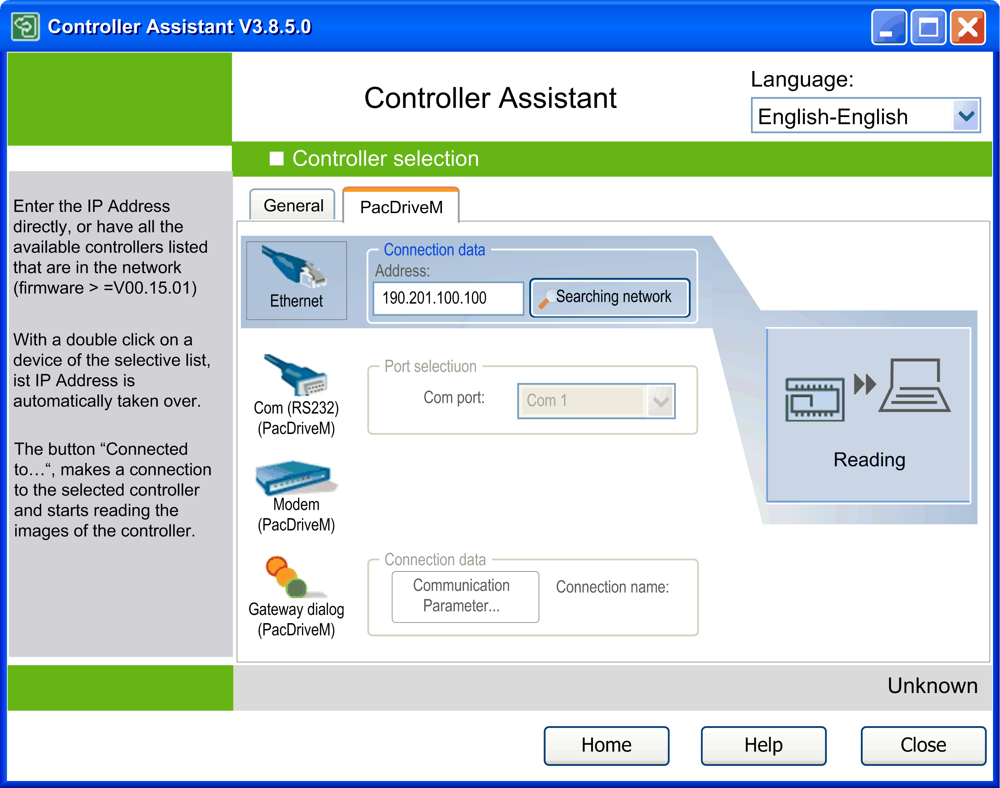
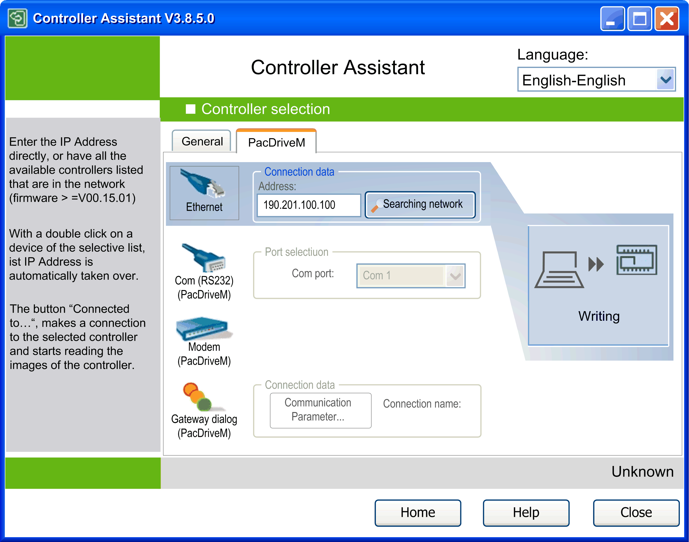

# Description of the Controller Selection Dialog for PacDrive M Controllers

## Overview

To open the dialog Controller selection, click one of the buttons Read from... or Write to... a controller on the Manage images dialog.

To connect to a PacDrive M controller, click the PacDriveM tab. This chapter describes the specific settings for PacDrive M controllers.

## Read from...

The PacDriveM tab contains the various options for PacDrive M controller selection for Read from... and the Write to... operations. To load an image from a PacDrive M controller, click the Read from... controller button in the Manage images dialog and select the PacDriveM tab of the Controller selection dialog.

Select a data transfer method from the list on the left-hand side (Ethernet, Com port, Modem, or Gateway dialog), and enter further information to specify the PacDrive M controller (such as the IP address).

Click the Reading button to load the image. Refer to the paragraphs further below in this chapter on the configuration settings.

Use this dialog to select various access options for the PacDrive M controller.

## Write to...

To write an image to a PacDrive M controller, click the Write on... controller button in the Manage images dialog and select the PacDriveM tab of the Controller selection dialog. In the Write to... dialog, click the Writing button to transfer the image to the controller.

The writing process during the transfer of an image can be canceled.

If the transfer of an image to a PacDrive M controller is canceled, the controller is in an undefined state. As long as the PacDrive M controller is not restarted, an image transfer can be performed again. If the controller is powered off in the meantime, you have to remove the flash disk from the controller. Transfer the image directly via a card reader.

Existing license points are not a component part of an image but are a part of a flash disk. They cannot be copied. They are not changed when writing an image to the flash disk or PacDrive M controller.

Use this dialog to select various access options for the PacDrive M controller.

## Ethernet Communications

Select the option Ethernet in order to communicate with PacDrive M controllers. It is the fastest method to read and write data.

NOTE: For the other transfer methods, long waiting periods during the transfer are to be expected when exchanging large volumes of data.

Ethernet communication uses the TCP/IP protocol. To establish a communication, a valid IP address of the controller is required. You can enter it directly in the text box Address. To execute a search for the controllers available in the network, click the button Search network. This dialog starts the Network Device Identification function. It is also available in the General tab of the Controller selection dialog. For further information, refer to the chapter [*Configuration of the Controller Access Options*](D-SE-0031850.html#D-SE-0031850).

## Serial Communications

If the controller is connected to the PC using a serial cable, select the option Com (RS232). Select the Com Port where the controller is connected, and click the Reading or Writing button.

## Communication Via Modem

Before you can communicate with the PacDrive M controller via modem, configure the modem connection on the PC using the Windows modem features. For further information on this topic, refer to the Windows online help.

Configure the PacDrive M controller for modem communication.

After the connection via modem has been configured, you can select the option Modem, and click the Reading or Writing button.

Incomplete file transfers, such as data files, application files and/or firmware files, may have serious consequences for your machine or controller. If you remove power, or if there is a power outage or communication interruption during a file transfer, your machine may become inoperative, or your application may attempt to operate on a corrupted data file. If an interruption occurs, reattempt the transfer. Be sure to include in your risk analysis the impact of corrupted data files.

| WARNING | |
| --- | --- |
|  | UNINTENDED EQUIPMENT OPERATION, DATA LOSS, OR FILE CORRUPTION  * Do not interrupt an ongoing data transfer. * If the transfer is interrupted for any reason, re-initiate the transfer. * Do not place your machine into service until the file transfer has completed successfully, unless you have accounted for corrupted files in your risk analysis and have taken appropriate steps to prevent any potentially serious consequences due to unsuccessful file transfers.  Failure to follow these instructions can result in death, serious injury, or equipment damage. |

If the communication to the controller is interrupted during firmware update, for example, due to a reset of the serial line configuration, your device may become inoperative.

| NOTICE | |
| --- | --- |
|  | LOSS OF DATA  Do not use a modem connection for updating the firmware.  Failure to follow these instructions can result in equipment damage. |

## Communication Via Gateway

To establish a communication to the controller via gateway, set the Communication parameters and define a Connection name, and click the Reading or Writing button.

## Changing the Communication Settings of a PacDrive M Controller Via Serial Data Transfer

If the PacDrive M controller is connected to the PC using a serial cable, click the button  Transfer communication settings serial to a controller.... The Transfer communication settings serial dialog box opens. It allows you to enter the IP address, the Subnet mask, and the Gateway you want to assign to the PacDrive M controller. Select the Com port where the PacDrive M controller is connected, and click OK to transfer the settings to the PacDrive M controller.

After successful transfer of the communication settings, you can transmit the data of the PacDrive M controller via the fast Ethernet connection. The communication settings can also be changed via the contextual menu. However, to this end the PacDrive M controller must already be visible in the network (from firmware version >= V00.15.00).

EIO0000001671.07