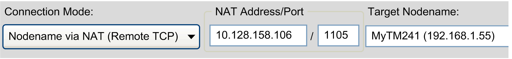
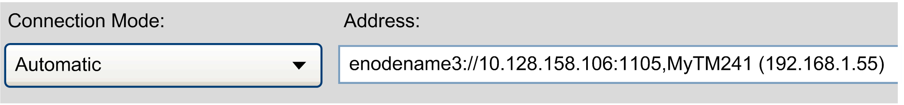
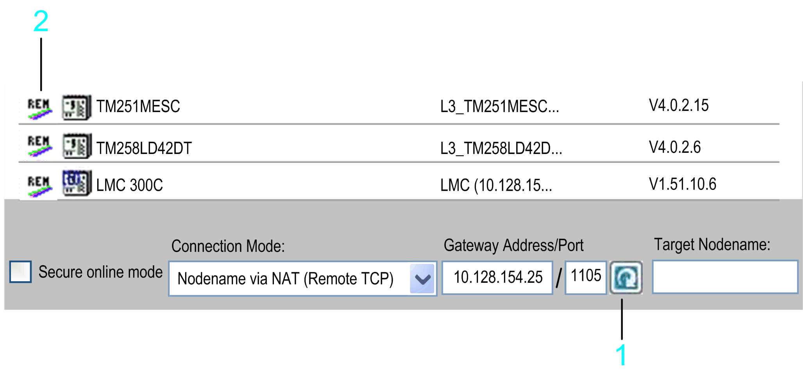
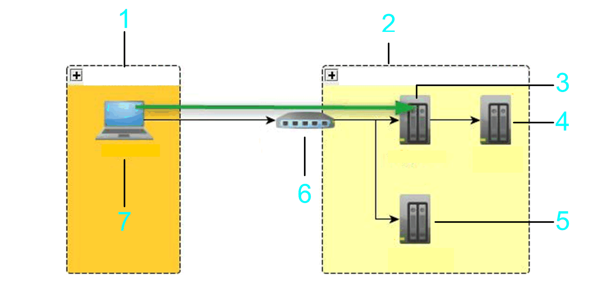

# Specifying the Connection Mode

## Overview

The Connection Mode list at the lower left of the Communication Settings tab allows you to select a format for the connection address you have to enter in the Address field.

The following formats are supported:

* [Automatic](#D-SE-0077990__D-SE-0077990.9)
* [Nodename](#D-SE-0077990__D-SE-0077990.11)
* [IP Address](#D-SE-0077990__D-SE-0077990.12)
* [IP Address (Fast TCP)](#D-SE-0077990__D-SE-0077990.21)
* [Nodename via NAT (Remote TCP)](#D-SE-0077990__D-SE-0077990.13) (NAT = network address translation)
* [IP Address via NAT (Remote TCP)](#D-SE-0077990__D-SE-0077990.14)
* [Nodename via Gateway](#D-SE-0077990__D-SE-0077990.15)
* [IP Address via Gateway](#D-SE-0077990__D-SE-0077990.16)
* [Nodename via MODEM](#D-SE-0077990__D-SE-0077990.17)
* [IP Address (PacDriveM only)](#D-SE-0077990__D-SE-0077990.20) (only available in service tools like Controller Assistant)

NOTE: After you have changed the Connection Mode, it may be required to perform the login procedure twice to gain access to the selected controller.

## Connection Mode > Automatic

If you select the option Automatic from the Connection Mode list, you can enter the nodename, the IP address, or the connection URL (uniform resource locator) to specify the Address.

NOTE: Do not use spaces at the beginning or end of the Address.

If you have selected another Connection Mode and you have specified an Address for this mode, the address you specified will still be available in the Address box if you switch to Connection Mode > Automatic.

Example:

Connection Mode > Nodename via NAT (Remote TCP) selected and address and nodename specified

If you switch to Connection Mode > Automatic, the information is converted to a URL, starting with the prefix `enodename3://`

If an IP address has been entered for the connection mode, the information is converted to a URL starting with a prefix. For the Connection Mode > IP Address , the prefix `etcp3://` is used. For the Connection Mode > IP Address (Fast TCP) , the prefix `etcp4://` is used. For example, `etcp4://<IpAddress>`.

NOTE: In the Controller Assistant and the Diagnostics tools, an IP address can additionally have the prefix `etcp2://`. This is only available for PacDrive M controllers.

If a nodename has been entered for the connection mode (for example, when Connection Mode > Nodename has been selected), the information is converted to a URL starting with the prefix `enodename3://`. For example, `enodename3://<Nodename>`.

## Connection Mode > Nodename

If you select the option Nodename from the Connection Mode list, you can enter the nodename of a controller to specify the Address. The text box is filled automatically if you double-click a controller in the list of controllers.

Example: Nodename: `MyM238 (10.128.158.106)`

If the controller you selected does not provide a nodename, the Connection Mode automatically changes to IP Address, and the IP address from the list is entered in the Address box.

## Connection Mode > IP Address

If you select the option IP Address from the Connection Mode list, you can enter the IP address of a controller to specify the Address. The text box is filled automatically if you double-click a controller in the list of controllers.

Example: IP Address: `190.201.100.100`

If the controller you selected does not provide an IP address, the Connection Mode automatically changes to Nodename, and the nodename from the list is entered in the Address box.

NOTE: Enter the IP address according to the format `<Number>.<Number>.<Number>.<Number>`

## Connection Mode > IP Address (Fast TCP)

If you select the option IP Address (Fast TCP) from the Connection Mode list, you can connect to a controller using the TCP protocol. Enter the Target IP address/Port of the controller in the respective field. You can adapt the default setting 11740 for the Port if you are using network address translation (NAT).

Example: IP Address: `190.201.100.100`

NOTE: Enter the IP address according to the format `<Number>.<Number>.<Number>.<Number>`

If the controller is not listed in the list of controllers, click the Test button. If the controller sends a response to the network scan, an entry for this controller is added to the list of controllers. This entry is marked by the icon TCP being displayed in the first column.

NOTE: This function is not available for all supported controllers. Consult the *Programming Guide* specific to your controller to find out whether it supports the IP Address (Fast TCP) connection mode.

## Connection Mode > IP Address (PacDriveM only)

If you select the option IP Address (PacDriveM only) from the Connection Mode list, you can enter the IP address of a controller to specify the Address. The box is filled automatically if you double-click a PacDrive M controller in the list of controllers.

Example: IP Address: `190.201.100.100`

NOTE: Enter the IP address according to the format `<Number>.<Number>.<Number>.<Number>`

## Connection Mode > Nodename via NAT (Remote TCP)

If you select the option Nodename via NAT (Remote TCP) from the Connection Mode list, you can specify the address of a controller that resides behind a NAT router in the network. Enter the nodename of the controller, and the IP address or host name and port of the NAT router.

**1** PC

**2** NAT router

**3** Target device

Example: NAT Address/Port: `10.128.158.106`/`1105` Target Nodename: `MyM238 (10.128.158.106)`

NOTE: Enter a valid IP address (format `<Number>.<Number>.<Number>.<Number>`) or a valid host name for the NAT Address.

Enter the port of the NAT router to be used. Otherwise, the default port 1105 is used.

The information you enter is interpreted as a URL that creates a remote TCP bridge - using TCP block driver - and then connects by scanning for a controller with the given nodename on the local gateway.

NOTE: The NAT router can be located on the target controller itself. You can use it to create a TCP bridge to a controller.

You can also scan a remote network via a remote controller (bridge controller). To achieve this, enter the NAT Address/Port, and click the refresh button right to the NAT Address/Port text field. The controllers that send a response to the remote network scan are listed in the list of controllers. Each of these entries is marked by the icon REM being displayed in the first column. To fill the list with more detailed information, right-click a controller entry and execute the command Refresh this controller. If the controller supports this function, further information on the controller is added to the list. Consult the *Programming Guide* specific to your controller.

**1** Refresh button

**2** **REM** icon

In the following example, the bridge controller, controller 2, and controller 3 are scanned.

**1** Local subnet

**2** Remote subnet

**3** Bridge controller

**4** Controller 3

**5** Controller 2

**6** NAT router

**7** PC

## Connection Mode > IP Address via NAT (Remote TCP)

If you select the option IP Address via NAT (Remote TCP) (NAT = network address translation) from the Connection Mode list, you can specify the address of a controller that resides behind a NAT router in the network. Enter the IP address of the controller, and the IP address or host name and port of the NAT router.

**1** PC

**2** NAT router

**3** Target device

Example: NAT Address/Port: `10.128.154.206`/`1105` Target IP Address: `192.168.1.55`

NOTE: Enter a valid IP address (format `<Number>.<Number>.<Number>.<Number>`) or a valid host name for the NAT Address.

Enter the port of the NAT router to be used. Otherwise, the default port 1105 is used.

Enter a valid IP address (format `<Number>.<Number>.<Number>.<Number>`) for the Target IP Address.

The information you enter is interpreted as a URL that creates a remote TCP bridge - using TCP block driver - and then connects by scanning for a controller with the given nodename on the local gateway. The IP address is searched in the nodename (such as `MyController (10.128.154.207)`) or by calling a service on each scanned device of the gateway.

NOTE: The NAT router can be located on the target controller itself. You can use it to create a TCP bridge to a controller.

You can also scan a remote network via a remote controller (bridge controller). To achieve this, enter the NAT Address/Port, and click the refresh button right to the NAT Address/Port text field. The controllers that send a response to the remote network scan are listed in the list of controllers. Each of these entries is marked by the icon REM being displayed in the first column. To fill the list with more detailed information, right-click a controller entry and execute the command Refresh this controller. If the controller supports this function, further information on the controller is added to the list. Consult the *Programming Guide* specific to your controller.

**1** Refresh button

**2** **REM** icon

In the following example, the bridge controller, controller 2, and controller 3 are scanned.

**1** Local subnet

**2** Remote subnet

**3** Bridge controller

**4** Controller 3

**5** Controller 2

**6** NAT router

**7** PC

## Connection Mode > Nodename via Gateway

If you select the option Nodename via Gateway from the Connection Mode list, you can specify the address of a controller that resides behind or close to a gateway router in the network. Enter the nodename of the controller, and the IP address or host name and port of the gateway router.

**1** PC

**2** PC / devices with gateway

**3** Target device

Example: Gateway Address/Port: `10.128.156.28`/`1217` and Target Nodename: `MyPLC`

NOTE: Enter a valid IP address (format `<Number>.<Number>.<Number>.<Number>`) or a valid host name for the Gateway Address/Port:.

Enter the port of the gateway router to be used. Otherwise, the default gateway port 1217 is used.

Do not use spaces at the beginning or end and do not use commas in the Target Nodename box.

The information you enter is interpreted as a URL. The gateway is scanned for a device with the given nodename that is directly connected to this gateway. Directly connected means it is the root node itself or a child node of the root node.

NOTE: The gateway can be located on an HMI, destination PC, or the local PC, making it possible to connect to a device that has no unique nodename but resides in a subnet behind an EcoStruxure Machine Expert/EcoStruxure Automation Expert - Motion network.

The graphic shows an example that allows a connection from the PC to the target controller 3 (item 4 in the graphic) by using the address of hop PC2 (item 5 in the graphic) that must have an EcoStruxure Machine Expert/EcoStruxure Automation Expert - Motion gateway installed.

**1** Hop PC 1

**2** Target controller 1: MyNotUniqueNodename

**3** Target controller 2: MyNotUniqueNodename

**4** Target controller 3: MyNotUniqueNodename

**5** Hop PC 2

**6** PC / HMI

**7** Router

**8** Ethernet

To verify whether the connection to a specific controller can be established, enter the Gateway Address/Port, and click the Test button. If the controller sends a response to the network scan, an entry for this controller is added to the list of controllers. This entry is marked by the icon GAT being displayed in the first column.

To scan a specific gateway for available controllers, enter the Gateway Address/Port, and click the refresh button right to the Gateway Address/Port text field. The controllers that send a response to the gateway scan are listed in the list of controllers. Each of these entries is marked by the icon GAT being displayed in the first column. To fill the list with more detailed information, right-click a controller entry and execute the command Refresh this controller. If the controller supports this function, further information on the controller is added to the list. Consult the *Programming Guide* specific to your controller.

**1** Refresh button

**2** **GAT** icon

The gateway that is scanned can be located on a PC that can reside in the local or in a remote subnet. In the following example, the bridge target controller 1 and target controller 2 are scanned.

**1** Local subnet

**2** Remote subnet

**3** Target controller 1

**4** Target controller 2

**5** Gateway

**6** PC

**7** Ethernet

You can connect to the listed devices using the gateway.

## Connection Mode > IP Address via Gateway

If you select the option IP Address via Gateway from the Connection Mode list, you can specify the address of a controller that resides behind or close to a gateway router in the network. Enter the IP address of the controller, and the IP address or host name and port of the gateway router.

**1** PC

**2** PC / devices with gateway

**3** Target device

Example: Gateway Address/Port: `10.128.156.28`/`1217` and Target IP Address: `10.128.156.222`

NOTE: Enter a valid IP address (format `<Number>.<Number>.<Number>.<Number>`) or a valid host name for the Gateway Address/Port:.

Enter the port of the gateway router to be used. Otherwise, the default gateway port 1217 is used.

Enter a valid IP address (format `<Number>.<Number>.<Number>.<Number>`) for the Target IP Address.

The information you enter is interpreted as a URL. The gateway is scanned for a device with the given IP address. The IP address is searched in the nodename (such as `MyController (10.128.154.207)`) or by calling a service on each scanned device of the gateway.

NOTE: The gateway can be located on an HMI, destination PC, or the local PC. It is therefore possible to connect to a device that has no unique nodename but resides in a subnet behind an EcoStruxure Machine Expert/EcoStruxure Automation Expert - Motion network.

The graphic shows an example that allows a connection from hop PC2 (item 5 in the graphic) that must have an EcoStruxure Machine Expert/EcoStruxure Automation Expert - Motion gateway installed to the target controller 3 (item 4 in the graphic).

**1** Hop PC 1

**2** Target controller 1: 10.128.156.20

**3** Target controller 2: 10.128.156.20

**4** Target controller 3: 10.128.156.20

**5** Hop PC 2

**6** PC

**7** Router

**8** Ethernet

To verify whether the connection to a specific controller can be established, enter the Gateway Address/Port, and click the Test button. If the controller sends a response to the network scan, an entry for this controller is added to the list of controllers. This entry is marked by the icon GAT being displayed in the first column.

To scan a specific gateway for available controllers, enter the Gateway Address/Port, and click the refresh button right to the Gateway Address/Port text field. The controllers that send a response to the gateway scan are listed in the list of controllers. Each of these entries is marked by the icon GAT being displayed in the first column. To fill the list with more detailed information, right-click a controller entry and execute the command Refresh this controller. If the controller supports this function, further information on the controller is added to the list. Consult the *Programming Guide* specific to your controller.

**1** Refresh button

**2** **GAT** icon

The gateway that is scanned can be located on a PC that can reside in the local or in a remote subnet. In the following example, the bridge target controller 1 and target controller 2 are scanned.

**1** Local subnet

**2** Remote subnet

**3** Target controller 1

**4** Target controller 2

**5** Gateway

**6** PC

**7** Ethernet

You can connect to the listed devices using the gateway.

## Connection Mode > Nodename via MODEM

If you select the option Nodename via MODEM from the Connection Mode list, you can specify a controller that resides behind a modem line.

**1** PC

**2** PC / MODEM

**3** Target modem

**4** Target device

**5** Phone line

To establish a connection to the modem, click the MODEM > Connect button. In the Modem Configuration dialog box, enter the Phone number of the target modem and configure the communication settings. Click OK to confirm and to establish a connection to the modem.

If the EcoStruxure Machine Expert/EcoStruxure Automation Expert - Motion gateway is stopped and restarted, any connection of the local gateway is terminated. EcoStruxure Machine Expert/EcoStruxure Automation Expert - Motion displays a message that has to be confirmed before the restart process is started.

After the connection to the modem has been established successfully, the MODEM button changes from Connect to Disconnect. The list of controllers is cleared and refreshed scanning the modem connection for connected controllers. You can double-click an item from the list of controllers or enter a nodename in the Target Nodename: box to connect to a specific controller.

Click the MODEM > Disconnect button to terminate the modem connection and to stop and restart the EcoStruxure Machine Expert/EcoStruxure Automation Expert - Motion gateway. The list of controllers is cleared and refreshed scanning the Ethernet network.

EIO0000001671.07