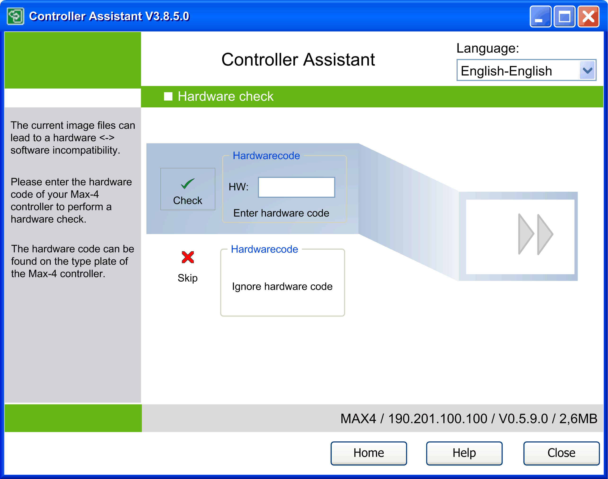

# Description of the Hardware Check Dialog for PacDrive M Controllers

## Overview

The Hardware check dialog opens automatically when PacDrive M controllers with specific firmware versions are used.

To execute a hardware check, enter the hardware code of the controller in the HW: text box. You can find the hardware code on the type plate of the controller. Click the Check button to execute the verification process.

You can ignore this check by clicking the Skip button. In this case, it will not be verified whether the image is suitable for the controller.

If there is an incompatibility between the image and the controller, the axis connected via Sercos can run in an unintended way (for example, at an unspecified speed), or rendered the controller unable to respond to communications nor change state.

| WARNING | |
| --- | --- |
|  | UNINTENDED EQUIPMENT OPERATION OR INOPERABLE EQUIPMENT  Always use the latest firmware to help avoid incompatibilities between image and controller.  Failure to follow these instructions can result in death, serious injury, or equipment damage. |

EIO0000001671.07