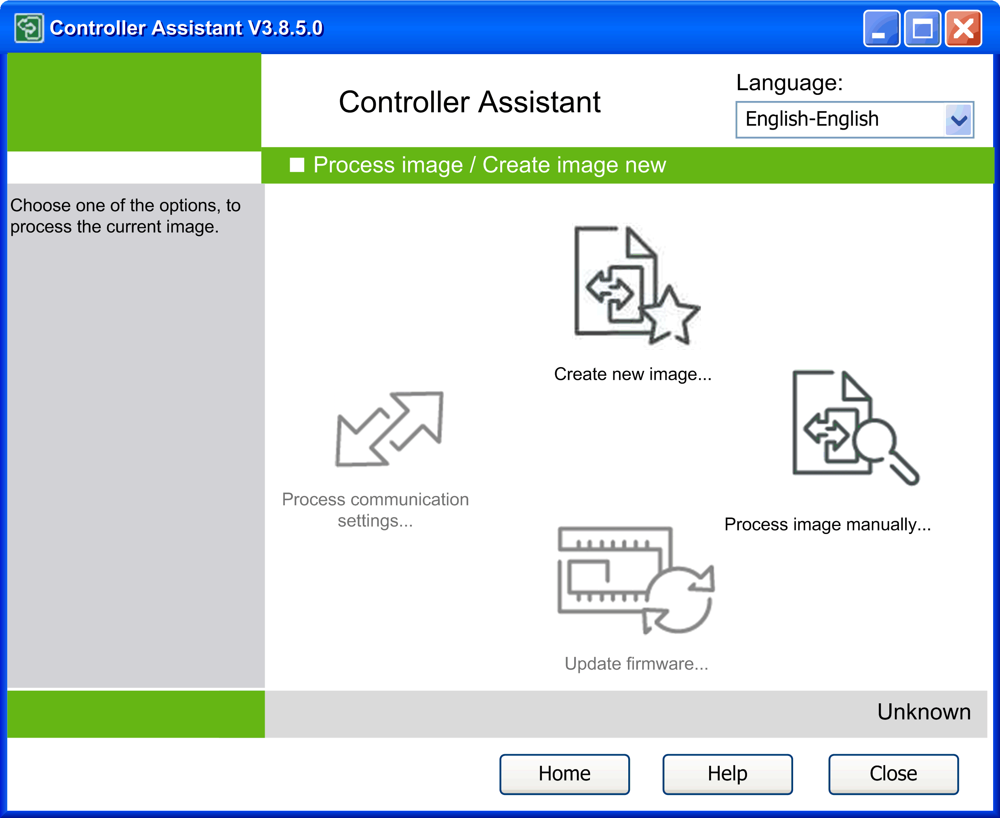

# Description of the Process Image / Create Image New Dialog Box

## Overview

To open the Process image / Create image new dialog, click the New / Process... button on the Manage images dialog.

Process image / Create image new dialog

The Controller Assistant saves the selected image for internal processing temporarily in the directory *\Image\*. The path is displayed in the ImageManager dialog.

The Process image / Create new image dialog contains buttons that provide access to further functions of the Controller Assistant.

EIO0000001671.07