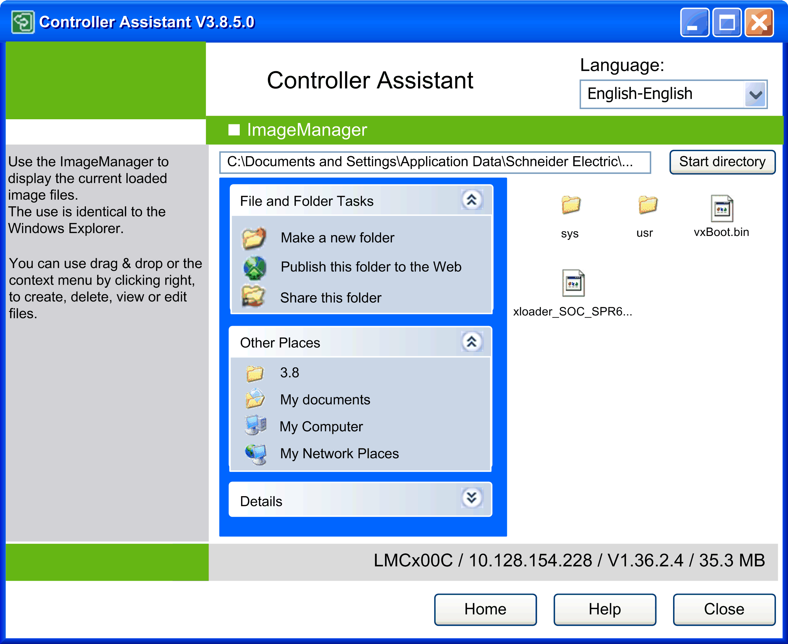

# Description of the ImageManager Dialog

## Overview

To open the dialog ImageManager, click the button Process image manually... in the Process image / Create image new dialog.

The Controller Assistant saves the selected image for internal processing temporarily in the directory *\Image\*. The path to and the content of this directory are displayed in this dialog.

ImageManager dialog for editing the image manually

## Content of the Dialog

The ImageManager dialog displays the files and directories contained in the image similar to a Windows Explorer. It allows you to copy, rename, and move the files and directories.

Several functions are provided via the contextual menu. Right-click an item and select the requested function from the list.

To open a subdirectory, double-click a folder icon. To return to the root directory, click the Start directory button.

| NOTICE | |
| --- | --- |
|  | UNINTENDED MODIFICATIONS OF THE FIRMWARE  * Do not modify, or manually intervene with, the original image. * Only use the Controller Assistant to carry out updates and changes for the firmware of the controller.  Failure to follow these instructions can result in equipment damage. |

EIO0000001671.07