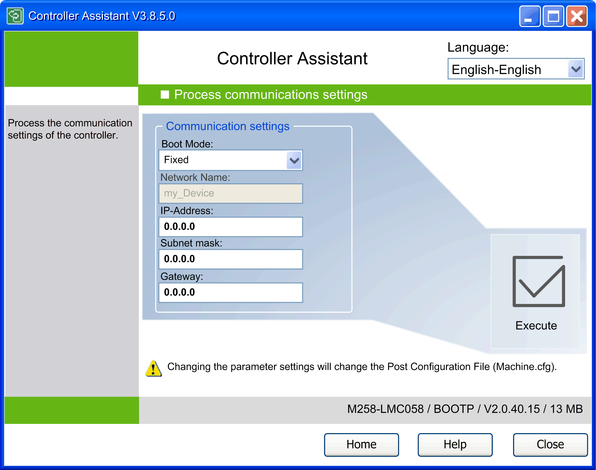

# Description of the Process Communication Settings Dialog

## Overview

To open the Process Communication Settings dialog, click the button Process communication settings... in the Process image / Create image new dialog.

Carefully manage the IP addresses because each device on the network requires a unique address. Having multiple devices with the same IP address can cause unintended operation of your network and associated equipment.

| WARNING | |
| --- | --- |
|  | UNINTENDED EQUIPMENT OPERATION  * Verify that there is only one main controller configured on the network or remote link. * Verify that all devices have unique addresses. * Obtain your IP address from your system administrator. * Confirm that the IP address of the device is unique before placing the system into service. * Do not assign the same IP address to any other equipment on the network. * Update the IP address after cloning any application that includes Ethernet communications to a unique address.  Failure to follow these instructions can result in death, serious injury, or equipment damage. |

Enter the communications settings. Click the Execute button to confirm.

Process Communication Settings dialog

The communication settings vary depending on the controller. The illustration shows the communication setting for LMC058 / M258 / M241 / M251 / M221 controllers.

For these controllers, the parameter Boot Mode is by default set to the value Fixed and the IP-Address is set to 0.0.0.0. This has the effect that the communication settings on the controller remain unchanged. You can adapt the communication settings to your individual requirements.

NOTE: For LMC058 / M258 / M241 / M251 / M221 controllers, the modified parameters are written to the post configuration file *Machine.cfg* which overwrites the parameters of the EcoStruxure Machine Expert/EcoStruxure Automation Expert - Motion application.

Carefully manage the IP addresses because each device on the network requires a unique address. Having multiple devices with the same IP address can cause unintended operation of your network and associated equipment.

| WARNING | |
| --- | --- |
|  | UNINTENDED EQUIPMENT OPERATION  * Verify that there is only one main controller configured on the network or remote link. * Verify that all devices have unique addresses. * Obtain your IP address from your system administrator. * Confirm that the IP address of the device is unique before placing the system into service. * Do not assign the same IP address to any other equipment on the network. * Update the IP address after cloning any application that includes Ethernet communications to a unique address.  Failure to follow these instructions can result in death, serious injury, or equipment damage. |

EIO0000001671.07