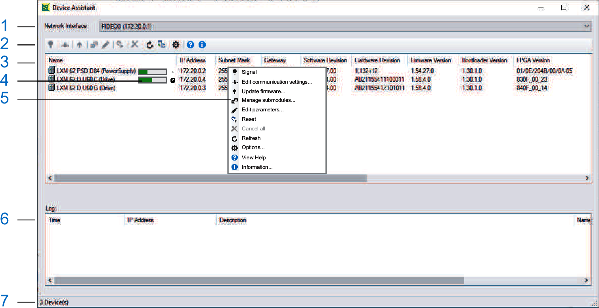

# Introduction

## Overview

The Device Assistant allows you to detect, configure, and update devices which are connected to a Sercos bus and communicate via None-Real-Time (NRT) services.

The computer is connected via Ethernet to the Sercos connector of the Sercos device by using an RJ45 cable.

## User Interface of Device Assistant

| Area | Description |
| --- | --- |
| 1 | Drop-down list  Network Interface  Select the Network Interface and the corresponding network adapter and click the  Refresh icon in the toolbar or in the context menu of the device to update your selection.  **Result:**   * Only the network adapters are listed that can actually be used (no tunnel or loopback adapters). * After the update, all available devices are listed. |
| 2 | Toolbar  All commands of the Device Assistant are available inside the toolbar and in the context menu of one or more selected devices. |
| 3 | Device list  Shows the detected devices and their corresponding communication parameters as well as other parameters. |
| 4 | The progress bar indicates the processing status of the current function.  Click the cross next to the progress bar if you want to cancel the operation. |
| 5 | If you right-click a device in the list, the [context-menu](D-SE-0059194.html#D-SE-0059194__D-SE-0059194.2) provides a selection of the actions available.  Depending on the selection of devices and the current state of the application, the commands are enabled or disabled. |
| 6 | The Log area shows the results of the realized function call-ups. For more information, refer to [*Logger*](D-SE-0059509.html#D-SE-0059509). |
| 7 | Status bar |

## Customizing the View

You can customize the view:

* Drag a column header to reorder the columns of the lists.

  The column order and its width are saved with the application and restored on next start.
* Click the column header to sort the columns of the device list.

  The number of displayed columns depends on the result of the refresh command.
* Change the height of the device list by moving the mouse on the bottom of the device list until the splitter symbol is shown. Click the symbol and move the mouse up or down.

EIO0000002291.03