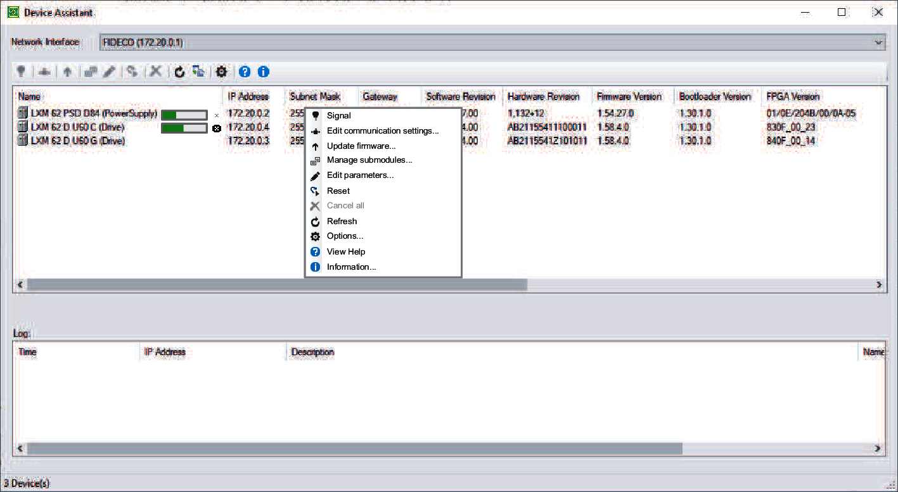

# General Overview

## Executing a Command

You can execute a command by means of the:

* Toolbar
* Context menu of the device list
* Context menu of a specific device

Depending on the selected device and the current state of the application, the commands are enabled or disabled.

* [Signal](D-SE-0059213.html#D-SE-0059213)
* [Edit communication settings](D-SE-0059195.html#D-SE-0059195)
* [Update firmware](D-SE-0059196.html#D-SE-0059196)
* [Manage submodules](D-SE-0059197.html#D-SE-0059197)
* [Edit parameters](D-SE-0059198.html#D-SE-0059198)
* [Reset](D-SE-0059199.html#D-SE-0059199)
* [Options](D-SE-0059224.html#D-SE-0059224)
* [Information](D-SE-0059225.html#D-SE-0059225)

EIO0000002291.03