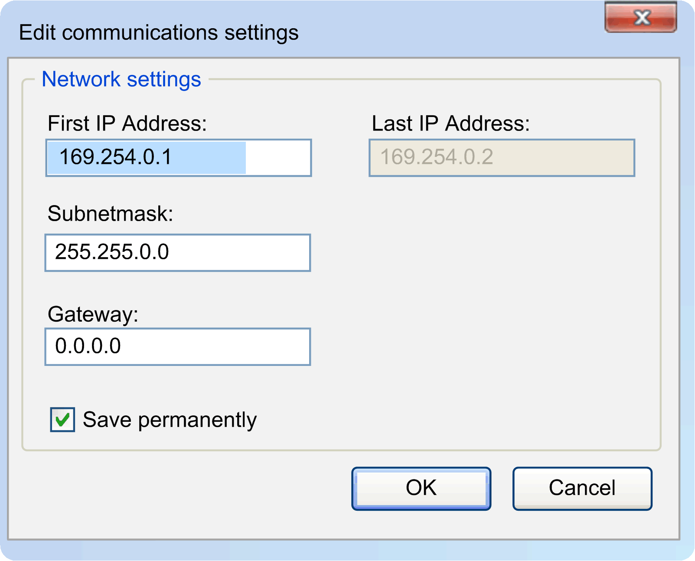

# Edit Communication Settings

## Overview

Right-click a device and select Edit communication settings...  to change the communication parameters:

* IP-Address
* Subnetmask
* Gateway

Select the Save permanently  check box, if you want your changes to be saved permanently or clear it, if you want your changes only to be saved for a short time.

The changed communication parameters are transferred to the selected device and the drop-down list is refreshed automatically.

## Edit Several Devices Simultaneously

You can select several devices in the device list and edit the communication parameters of several devices simultaneously.

Select more than one device by holding Ctrl  or Shift  when clicking.

This dialog allows you to assign an IP address range to the several selected devices:

Carefully manage the IP addresses because each device on the network requires a unique address. Having multiple devices with the same IP address can cause unintended operation of your network and associated equipment.

| WARNING | |
| --- | --- |
|  | UNINTENDED EQUIPMENT OPERATION  * Verify that there is only one master controller configured on the network or remote link. * Verify that all devices have unique addresses. * Obtain your IP address from your system administrator. * Confirm that the IP address of the device is unique before placing the system into service. * Do not assign the same IP address to any other equipment on the network. * Update the IP address after cloning any application that includes Ethernet communications to a unique address.  Failure to follow these instructions can result in death, serious injury, or equipment damage. |

| Element | Description |
| --- | --- |
| First IP Address | Enter the first address of the IP address range.  The proposed IP address range depends on the subnet and the IP address of the selected network interface.  The number of possible host addresses is 2 (that is, exclusive of the subnet ID and broadcast address). |
| Last IP Address | After changing the  First IP Address or the  Subnetmask, the  Last IP Address of the range is calculated as follows:  First IP Address  + the following IP addresses within the subnet which is defined by the Subnetmask  and the First IP Address .  NOTE:  * If the IP address of the selected network interface is within the range, the Last IP address  is increased by one address. * If the subnet is too small for the selected devices, no value is displayed under Last IP address  and OK is disabled. |
| OK | Assigns the IP addresses to the selected devices.   * In this process, same addresses are assigned to IP addresses that already exist. * If there are several identical addresses, the last device keeps its original IP address. * Every device is assigned the Subnetmask  and Gateway  that have been specified in the dialog. |

The following default settings result:

| Communication Parameter | Default Setting |
| --- | --- |
| First IP Address | The lowest possible IP address within the subnet is proposed. The address is entered automatically. |
| Subnetmask | The subnet mask of the currently selected network interface. |
| Gateway | 0.0.0.0 |

For further information, refer to [Brief instruction](D-SE-0059201.html#D-SE-0059201) and [Command line](D-SE-0059202.html#D-SE-0059202).

EIO0000002291.03