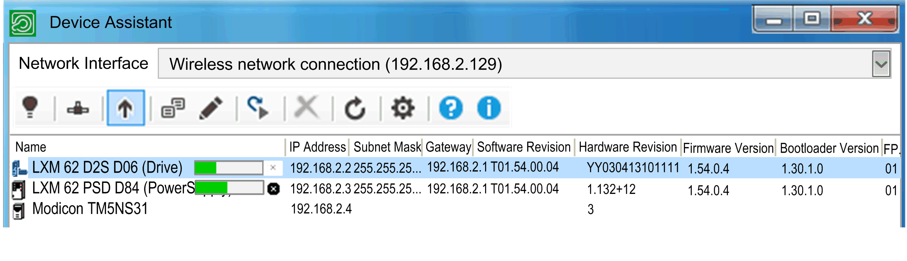

# Update Firmware

## Overview

Right-click a device and click Update firmware...  to update the firmware of the selected device.

If you want to execute a firmware update for more than one device, select the devices and hold Ctrl  or Shift  when clicking.

NOTE: If an update is executed, you need to ensure that all participants (service computer and devices) have the correct communication settings. Verify the communication settings of the devices and readjust them, if necessary.

The standard Windows dialog box Open  allows you to select a supported file format (\*.DAT,\*.FW, \*.SECO, \*.SEFIRMWARE) and transfer it to the device.

NOTE: The updates are not available until the device is restarted.

To execute the firmware you have downloaded, you need to restart the device. When the download of your firmware is finished, the  Device Assistant displays a dialog box, where you confirm if you want the device or the devices to be restarted.

## Cancel an Update

The command Update firmware...  shows a progress bar for each device:

You can cancel the operation:

* For each device by clicking the cross of the given devices progress bar.
* For all the devices of the device list by clicking  Cancel all.

For further information, refer to [Brief step-by-step instruction for firmware update](D-SE-0059201.html#D-SE-0059201) and [Command line](D-SE-0059202.html#D-SE-0059202).

EIO0000002291.03