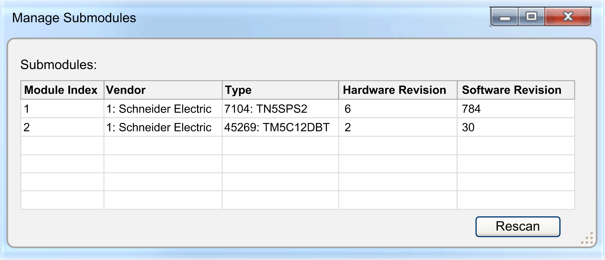

# Manage Submodules

## Overview

Right-click a device and select Manage submodules...  to view a list of submodules which are connected to the selected Sercos device (for example, TM5-modules connected to a TM5 bus coupler).

NOTE: Not all Sercos devices support submodules. In this case, the list is empty.

| Element | Description |
| --- | --- |
| Submodules | Provides information on:   * Module Index: Starts with 1 and represents the physical position of the submodule. * Vendor: Shows a code or an ID: A coding is provided for known devices. * Type: Shows a code or an ID. * Hardware Revision : Numerical values as provided by the device. * Software Revision : Numerical values as provided by the device. |
| Rescan | Calls the values of the submodules again. |

EIO0000002291.03