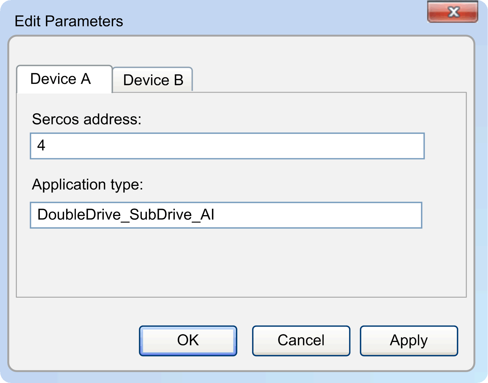

# Edit Parameters

## Overview

Right-click the device and select Edit parameters..  to change the parameters Sercos address or Application type:

If the device hardware includes more than one sub-device, several tabs are displayed for each sub-device, as in this example:

| Element | Description |
| --- | --- |
| Sercos address | The valid Sercos address is within the range from 1 to 511. |
| Application type | The maximum length of the  Application type string is defined by the device (usually 31 characters). |
| OK | Applies the entered values and closes the dialog. |
| Apply | Applies the values without closing the dialog.  If the set value is in invalid, an error message is displayed, in this example due to an invalid Sercos address: |

NOTE: Parameters can be read and write only if both the PC with Device Assistant  and the device reside in the same subnet. Otherwise, you get a message. In order to prepare the device with valid communication settings, use the command [**Edit communication settings...**](D-SE-0059195.html#D-SE-0059195).

For further information, refer to [Brief instruction](D-SE-0059201.html#D-SE-0059201) and [Command line](D-SE-0059202.html#D-SE-0059202).

Carefully manage the Sercos addresses because each device on the network requires a unique address. Having multiple devices with the same address can cause unintended operation of your network and associated equipment.

| WARNING | |
| --- | --- |
|  | UNINTENDED EQUIPMENT OPERATION  * Verify that all devices have unique addresses. * Confirm that the address of the device is unique before placing the system into service. * Do not assign the same address to any other equipment on the network.  Failure to follow these instructions can result in death, serious injury, or equipment damage. |

EIO0000002291.03