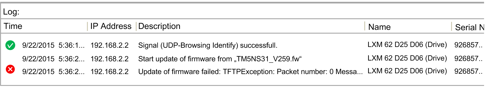

# Logger

## Overview

The logger protocols the command execution. If a command succeeds a green symbol for OK is shown, otherwise a red icon is displayed indicating a detected error.

If you right-click an entry in the Log window, the context menu provides the commands:

| Command | Description |
| --- | --- |
| Copy | Copies all entries of the logger into the clipboard. |
| Remove all | Removes all entries from the logger. |

EIO0000002291.03