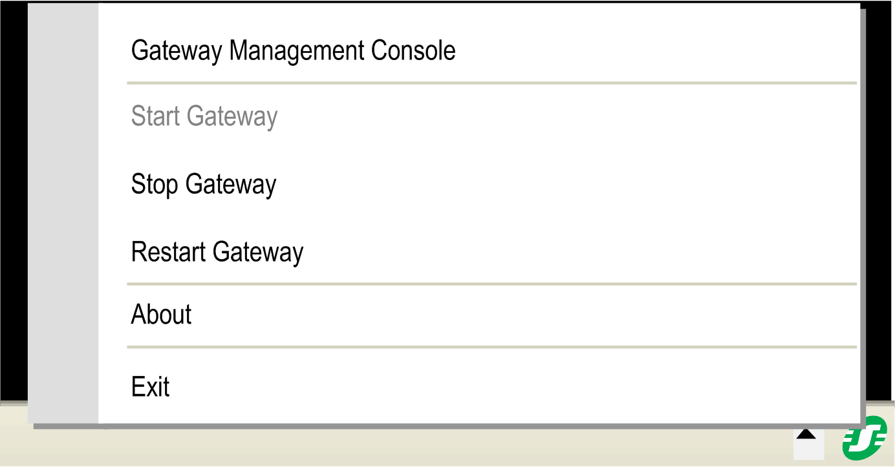

# Introduction

## Overview

The Gateway Management Console allows you to manage the EcoStruxure Machine Expert gateways installed on your PC, such as configuring the gateway, and switching between gateways. Quick access is provided by an icon provided in the Windows notification area.

EcoStruxure Machine Expert gateways are used to manage the communication between a controller and an application, such as Logic Builder, Controller Assistant, Diagnostics or OPC.

## Gateway Management Console Icon

In the Windows notification area of PCs hosting an EcoStruxure Machine Expert installation, you find the Gateway Management Console icon.

The icon is available in different colors that represent different states of the gateway service:

| Gateway Management Console icon | Color | Description |
| --- | --- | --- |
|  | green | The [selected gateway](D-SE-0056982.html#D-SE-0056982__D-SE-0056982.4) is running. |
|  | red | The [selected gateway](D-SE-0056982.html#D-SE-0056982__D-SE-0056982.4) is stopped. |
|  | green, crossed out | The Gateway Tray Service to which the Gateway Management Console is connected is stopped. |

Click the Gateway Management Console icon to open a menu that allows quick access to gateway management:

The Gateway Management Console menu allows you to perform the following tasks:

* Open the Gateway Management Console dialog box.
* Start, stop or restart the selected gateway service.
* Open the About dialog box of the Gateway Management Console.
* Exit the Gateway Management Console. This command removes the Gateway Management Console icon from the Windows notification area.

EIO0000002224.05