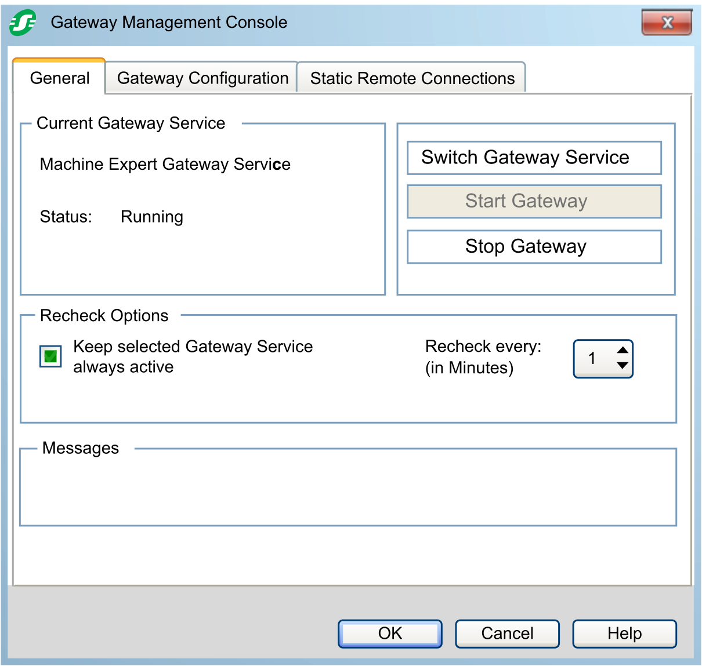
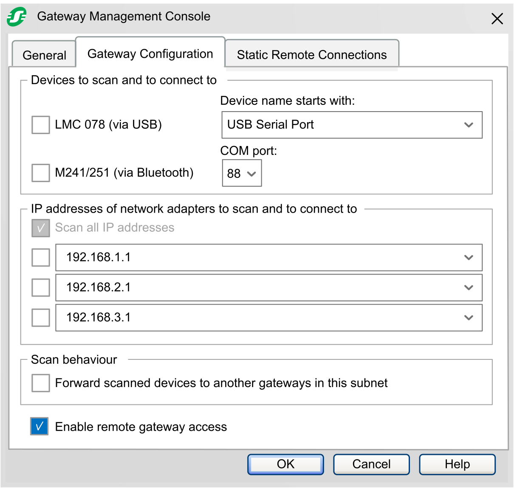
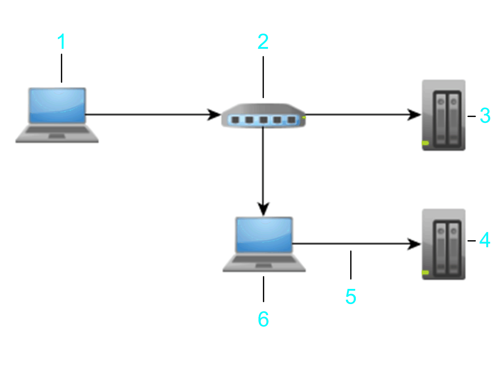
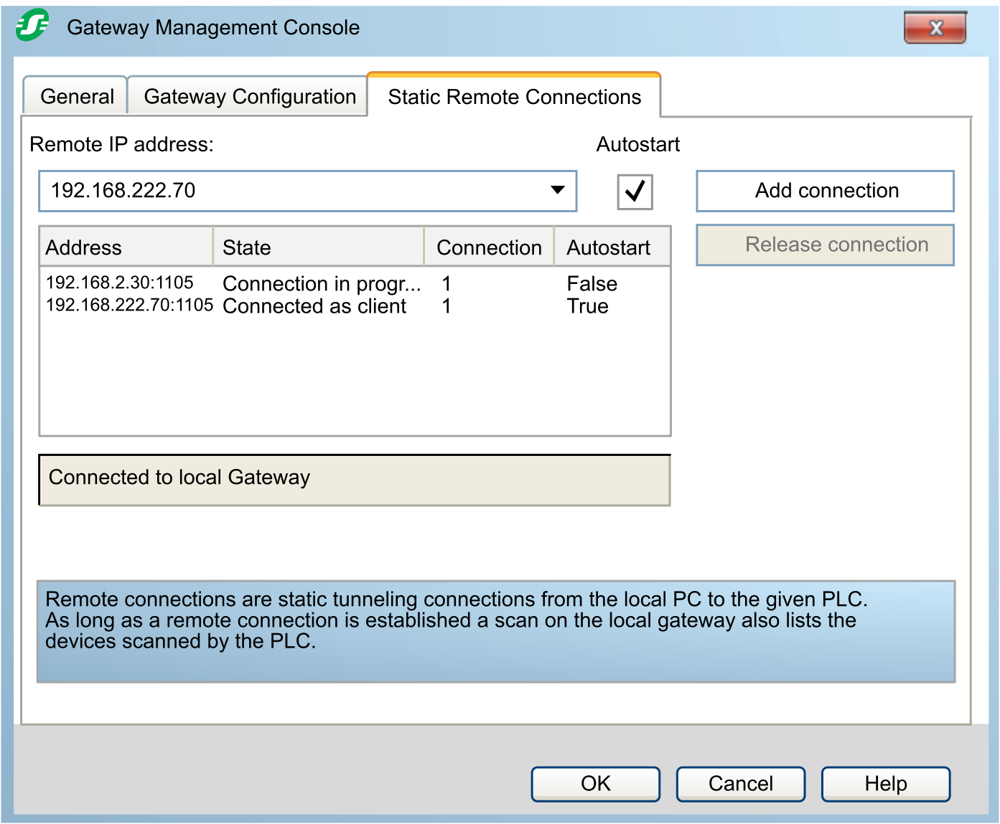

# Gateway Management Console Dialog Box

## Overview

To start the Gateway Management Console, double-click the Gateway Management Console icon in the Windows notification area, or click the icon and execute the command Gateway Management Console from the menu.

The Gateway Management Console dialog box consists of 3 tabs:

* the General [tab](#D-SE-0056982__D-SE-0056982.3)
* the Gateway Configuration [tab](#D-SE-0056982__D-SE-0056982.5)
* the Static Remote Connections [tab](#D-SE-0056982__D-SE-0056982.8)

## General Tab

| Section | Element | Description |
| --- | --- | --- |
| Current Gateway Service | | The Current Gateway Service section shows the name of the selected gateway service and provides its status. |
| Recheck Options | | The Recheck Options section provides options for watching the gateway service. |
| – | Keep selected Gateway Service always active | Enable the Keep selected Gateway Service always active option to verify automatically that the gateway service is active. Select the suitable time interval with the Recheck every: (in Minutes) parameter. |
| – | Recheck every: (in Minutes) | Select a time interval for executing checks on the gateway service if the Keep selected Gateway Service always active option is enabled. |
| Messages | | The Messages section provides space for hints or additional information, for example, about services. |

| Button | Description |
| --- | --- |
| Switch Gateway Service | Click the Switch Gateway Service button to select a gateway service.  **Result**: The Select new Gateway Service dialog box is displayed. Refer to the paragraph *Select a Gateway*. |
| Start Gateway | Click the Start Gateway button to start the selected gateway service. |
| Stop Gateway | Click the Stop Gateway button to stop the selected gateway service. |

## Select a Gateway

Any configurations or actions performed in the Gateway Management Console and from the Gateway Management Console menu apply to the selected gateway.

To select a gateway, proceed as follows:

| Step | Action |
| --- | --- |
| 1 | In the General tab of the Gateway Management Console, click the Switch Gateway Service button.  **Result**: The Select new Gateway Service dialog box is displayed. It shows a list of gateway services installed on your PC. |
| 2 | Select the gateway service of your choice and click OK.  Whenever you have modified the gateway configuration and confirm with OK, a message is displayed requesting you to restart the gateway for the modifications to become effective.  NOTE: A restart of the gateway closes active connections.  **Result**: The Current Gateway Service section of the General tab of the Gateway Management Console displays the name of the selected gateway and its status. |

## Gateway Configuration Tab

| Section | Element | Description |
| --- | --- | --- |
| Devices to scan and to connect to | | The Devices to scan and to connect to section allows you to activate/deactivate and configure the possibility of connecting to controllers by using a specific connection mode. |
| – | LMC 078 (via USB) | Select the LMC 078 (via USB) option to establish a connection to an LMC078 controller that is connected via USB. You can search for this controller by using the Windows Device Manager.  NOTE: LMC078 is supported by SoMachine. |
| – | Device name starts with: | In the Device name starts with: box, enter a string that is searched in the Windows Device Manager.  **Result**: The Device Manager shows the names of devices that are connected to the PC. The respective COM port is indicated in parenthesis.  At the end of the list, there are two entries USB Serial Port and Serial Port, USB Multi-function Cable for detecting devices independent of the COM port.  NOTE: In case there are several devices with similar names connected to your PC, enter the full name including the COM port of the LMC078 controller you want to connect to. |
| – | M241/251 (via Bluetooth) | Select the M241/251 (via Bluetooth) option to connect to an M241 or an M251 logic controller that is connected via Bluetooth. To achieve this, enter the respective COM port:. |
| – | COM port: | Select the COM port the Bluetooth adapter used by the M241 or M251 logic controller is connected to. |
| IP addresses of network adapters to scan and to connect to | | The IP addresses of network adapters to scan and to connect to section allows you to limit the search (scan) for controllers by the EcoStruxure Machine Expert gateway by selecting specific IP addresses of network adapters of your PC.  This allows you to work only with controllers connected to an additional network adapter that serves, for example, as a developer network. |
|  | Scan all IP addresses | Select the Scan all IP addresses option to perform a scan for controllers on all network adapters available from your PC. |
|  | Lists of IP addresses | The lists show the possible IP addresses and the related network adapters on the right.  Select an entry to limit the search for controllers to this specific IP address.    **Result**: The option is activated and the selected IP address is written in the text field of the list. On the right of the IP address, the network adapter is added as a comment starting with a semicolon.  You can edit or remove this comment, in both cases, preserve the semicolon.  This option of limiting the search to specific IP addresses help ensure to use unique nodenames throughout your network. |
| Scan behaviour | | – |
|  | Forward scanned devices to another gateways in this subnet | Activate the option Forward scanned devices to another gateways in this subnet to automatically forward the result of the network scan to another PC gateways in the same subnet. Refer to the paragraph *Example of Forwarding Scanned Devices*. |
| Enable remote gateway access | | Select this option to allow a remote PC access to the local gateway on this PC where an EcoStruxure Machine Expert gateway is running.  Remote gateway access is configured   * in the Logic Builder in the [Communication Settings tab in Controller selection mode](../../../../../api/crossBook?lang=en-US&virtualBookName=SoMProg&topicID=D_SE_0083385) (For further information, refer to the *Communication Settings in Controller Selection Mode* chapter of the EcoStruxure Machine Expert Programming Guide).  or * in the Communication Settings tab of the service tool [Controller Assistant](../../../../../api/crossBook?lang=en-US&virtualBookName=ContrAs&topicID=D_SE_0077990_15) or the [Diagnostics](../../../../../api/crossBook?lang=en-US&virtualBookName=Diagnost&topicID=D_SE_0077990_15) software.   When the connection modes [Nodename via Gateway](../../../../../api/crossBook?lang=en-US&virtualBookName=SoMProg&topicID=D_SE_0083385_15) or [IP Address via Gateway](../../../../../api/crossBook?lang=en-US&virtualBookName=SoMProg&topicID=D_SE_0083385_16) are selected (see links above), it is possible to scan for available controllers on a remote PC provided that on this PC the option described herein, Enable remote gateway access, is selected.  As opposed to prior versions, with EcoStruxure Machine Expert V2.3 and later versions, the remote gateway access is disabled by default. Therefore, you will need to manually enable the feature. |

## Example of Forwarding Scanned Devices

A controller (4) that is connected to **PC 2** (6) via **USB** or an additional **Ethernet** network adapter is also scanned by the gateway of **PC 1** (1).

**1** PC 1

**2** Switch 1

**3** Controller 1

**4** Controller 2

**5** USB / Ethernet

**6** PC 2

NOTE: In prior released versions of the gateway software (prior to that released with SoMachine or SoMachine Motion V4.2), the list of connected devices was not editable, and the scanning of the network was always activated. In those prior versions, this had the consequence of having all devices, including devices that were not intended to be part of the list of devices, to appear. Further, this left open the possibility to have devices appear that had the same nodenames but were attached to other gateways (see graphic above).

You can avoid such situations in the used subnet by replacing previous gateway installations in the subnet by gateway installations of EcoStruxure Machine Expert, or SoMachine / SoMachine Motion V4.2 or later.

## Static Remote Connections Tab

The Static Remote Connections tab allows you to establish connections to controllers that are located in different subnets than the PC running your programming software. In order to achieve this, IP tunnel connections are established between the local PC and the remote controllers.

| Element | | Description |
| --- | --- | --- |
| Remote IP address | | Enter the IP address and the port of the remote controller separated by a colon or select an IP address from the list.  Example: `10.128.234.17:1386`  If you use the default port 1105, it is sufficient to enter the IP address. |
| Autostart option | | Select the Autostart option for connections that will automatically be reestablished after a restart of the Gateway Management Console or of the PC running the Gateway Management Console. |
| Table listing static remote connections | | The table lists the connections to remote controllers by the IP address you entered in the Remote IP address box, including the Autostart selection. |
|  | Address column | Contains the IP address and the port of the remote controller. |
|  | State column | Indicates the status of the connection.  The following states are indicated:   * Connection in progress... is displayed as long as the connection between the programming software PC and the remote controller is being established. * Connected as client is displayed after the connection has been established successfully. * Connection released is displayed for a short time after the connection between the programming software PC and the remote controller has been terminated. |
|  | Connection column | You can connect several times from your PC to the given controller or to a controller connected to this controller through the IP tunnel connection. The Connection column indicates the number of instances, such as Logic Builder, Controller Assistant, Diagnostics, that are connected to the controller. |
|  | Autostart column | The connections that will automatically be reestablished after the Gateway Management Console or the PC running the Gateway Management Console have been restarted are marked with True in this cell. |
| Release connection button | | Click the Release connection button to terminate the connection to the selected controller. |
| Add connection button | | Click the Add connection button to establish a connection to the controller selected or entered in the Remote IP address box. |

## Establish a Connection to a Controller in a Different Subnet

In order to establish a connection to a controller located in a different subnet than the programming software PC, proceed as follows:

| Step | Action |
| --- | --- |
| 1 | In the box Remote IP address, enter the IP address and the port of the remote controller separated by a colon. |
| 2 | Click the Add connection button.  **Result**:  In the table, the IP address of the controller is displayed as new entry in the Address column and the State is indicated as Connection in progress....  After the connection has been established successfully, the State changes to Connected as client. |

As long as the connection is established, the corresponding remote controller and any controller it is connected to are listed in the Controller selection [view of the device editor](../../../../../api/crossBook?lang=en-US&virtualBookName=SoMProg&topicID=D_SE_0083385) whenever the view is updated.

In order to close the connection to the controller, select the entry in the list and click the Release connection button.

EIO0000002224.05