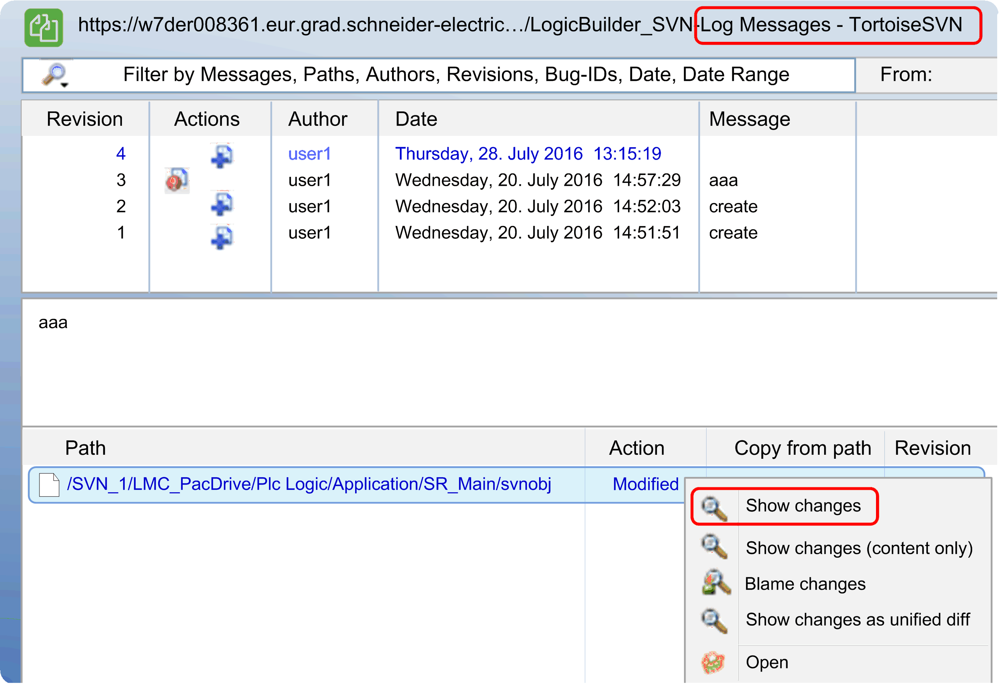

# Compare Two Revisions of One Object

## Overview

You can compare different revisions of the same object within the Log Messages - TortoiseSVN  dialog.

## How to Compare Two Revisions of One Object

| Step | Action |
| --- | --- |
| 1 | Select an object from the list.  NOTE: Logic Builder objects are named svnobj  and the name of its parent corresponds to the object name inside Logic Builder. |
| 2 | Double-click the item, or  Right-click the item and select Show changes .  **Result**:The Logic Builder Diff Viewer dialog opens presenting the comparison results. |

EIO0000002640.03