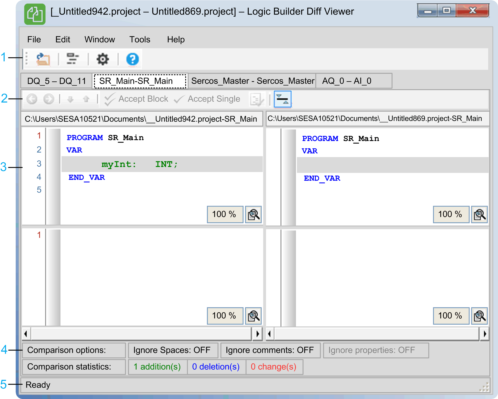

# Logic Builder Diff Viewer Dialog

## General Overview

The graphic presents the Logic Builder Diff Viewer dialog with the compare view in the middle section:

NOTE: For detailed information on the items of this dialog, refer to [*Working in the Compare Mode*](../../../../../api/crossBook?lang=en-US&virtualBookName=SoMMenu&topicID=D_SE_0083939).

| Item | Description |
| --- | --- |
| 1 | Toolbar |
| 2 | The toolbar on top of the compare results provides a set of functions to edit the comparison. |
| 3 | Compare view: more than one compare view can be opened in several tabs.  The left and the right pane correspond to the previously selected left and right object. |
| 4 | Details pane: Presents information on the comparison results. |
| 5 | Status bar |

## Description of the Buttons in the Toolbar

Place the cursor over a button in the toolbar to view the associated command as a tooltip.

The following table describes the buttons of the toolbar:

| Button | Description |
| --- | --- |
| Open | Click this button to open the  Select Files... [dialog](D-SE-0066770.html#D-SE-0066770) where you select the files to be compared and displayed in the left and the right panes of the compare view.  Alternatively, you can open this dialog by using the File menu. |
| Select Objects... | Click this button to open the  Select Objects [dialog](D-SE-0066771.html#D-SE-0066771), where you can choose the objects for comparison.  NOTE: If left and right side files have only one object, the menu is disabled.  Alternatively, you can open this dialog by using the File  menu. |
| Options | Click this button to open the  Options... dialog.  The  Options... dialog allows you to change the language. If you have changed the language, you are prompted for a restart of the application with the new language.  Alternatively, you can open this dialog by using the  Options menu. |
| Help | Click this button to open the online help. |

## Description of the Menu Bar

The following table describes the commands of the menu bar:

| Menu command | Description |
| --- | --- |
| File | |
| Open | Opens the Select Files...... dialog.   * If the file you want to open is password protected, you get a message that the file could not be opened. * If the left project was marked as [editable](D-SE-0066770.html#D-SE-0066770), you get the information that the project was automatically updated to the version of the connected Logic Builder Diff Viewer server.  NOTE: Editable projects require more time to open. |
| Select Objects... | Opens the Select Objects [dialog](D-SE-0066771.html#D-SE-0066771). |
| Close | Closes open tabs of the [compare view](D-SE-0066773.html#D-SE-0066773).  If the left project was marked as [editable](D-SE-0066770.html#D-SE-0066770), you are prompted to save the modifications. |
| Exit | Closes the application and opened projects or files.  If the left project was marked as [editable](D-SE-0066770.html#D-SE-0066770), you are prompted to save the modifications. |
| Edit | |
| Options | Opens the Options... dialog, where you can change the interface language. |
| Windows | |
| Close | Closes the selected [compare view](D-SE-0066773.html#D-SE-0066773).   * If there have been any modifications, you are prompted to apply the modifications to the left project. * You can close the compare view by a double-click or a mouse wheel click on the header of the compare view. |
| Close all | Closes open tabs of the [compare view](D-SE-0066773.html#D-SE-0066773).  If the left project was marked as [editable](D-SE-0066770.html#D-SE-0066770), you are prompted to save the modifications. |
| Tools | |
| Register/Unregister TortoiseSVN | Registers or unregisters this application to or from an already installed TortoiseSVN client.  The check box on the left-hand side of the command displays the current state. |
| Register/Unregister Windows Explorer | Registers or unregisters this application to or from the Windows Explorer.  The check box on the left-hand side of the command displays the current state. |
| Shutdown Logic Builder Diff Server(s) | Opens the Running Logic Builder Diff Viewer [dialog](D-SE-0066775.html#D-SE-0066775). |
| Help | |
| View Help | Opens the online help. |
| About... | Opens a dialog providing an overview about the version, the licences as well as techncial information on this application. |

EIO0000002640.03