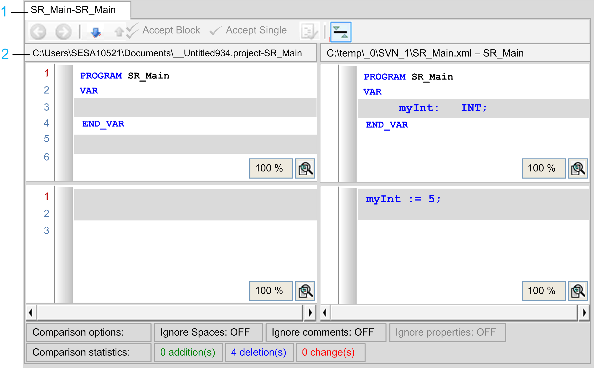
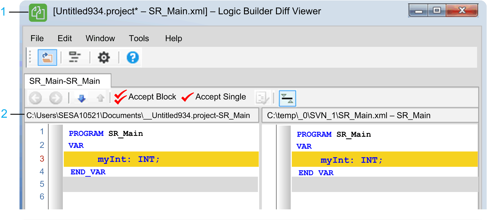

# Logic Builder Diff Viewer Compare View

## Overview

The compare view presents the compare results inside the Logic Builder comparison view that supports for example POUs in ST, CFC, SFC, IL, FBD, actions, or devices.

NOTE: For information on the meaning of colors, the symbols and icons of the compare view, refer to [*Working in the Compare Mode*](../../../../../api/crossBook?lang=en-US&virtualBookName=SoMMenu&topicID=D_SE_0083939).

| Item | Description |
| --- | --- |
| 1 | The header of the tab page displays the object names of both sides at once. |
| 2 | On both sides, the title on top displays the source URL and the selected object name on the right of the title.   * If the text is too long, it is shortened using ellipses (…) inside the path. * Clicking the label provides the full string that can be copied. * The URL can be the file path or a SVN URL with the revision number on the right side. |

NOTE: If the application was called from SVN with a newly added object, the left pane of the compare view is grayed out.

## Compare View of Project Marked as Editable

If you have marked the left project as [editable](D-SE-0066770.html#D-SE-0066770), you can edit the left project objects in the compare view.

| Item | Description |
| --- | --- |
| 1 | The left project in the title of this dialog is marked with an **\*** to indicate that the project has been modified.  If there are modifications, you are prompted to save the project on closing the compare view, or closing the project or the application at all. |
| 2 | For information on the icons displayed in this view, for example how to accept a block or single lines, refer to [*Working in the Compare Mode*](../../../../../api/crossBook?lang=en-US&virtualBookName=SoMMenu&topicID=D_SE_0083939). |

## Update to a Later Logic Builder Diff Viewer Version

Editable projects are automatically updated to the connected Logic Builder Diff Viewer [server version](D-SE-0066775.html#D-SE-0066775).

When the source project was opened with a different version, you are prompted to decide whether you want to save your project in its updated version.

EIO0000002640.03