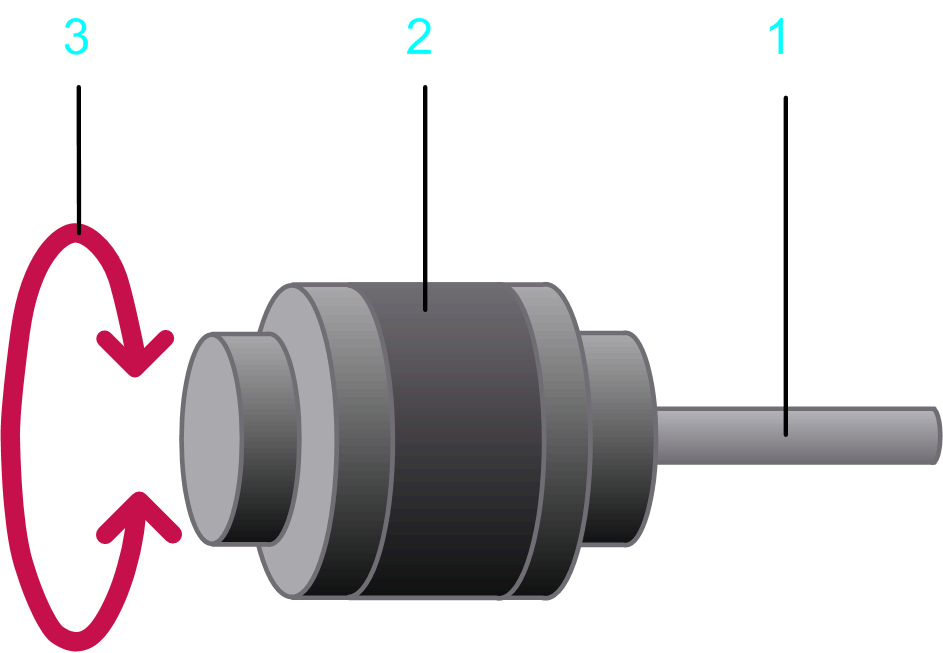

# General Load Case

## Overview

You can use the General load case option to adjust conditions that are not covered by the specific load cases described in the present document. It is applicable when there is a linear relationship between the input and output rotary motion, i.e. for a mechanics with a feed constant.

## Parameters

The General load case  allows you to specify the parameters indicated in the figure and described in the table:

**1** Input shaft

**2** Load

**3** Movement described by the motion profile

| Parameter | Description | Physical Quantity |
| --- | --- | --- |
| Feed constant | Advance of the load per revolution of the input shaft.  The unit of the feed constant determines the type of motion that will be performed at the load:   * °/revolution (rotary motion at the load) * mm/revolution (linear motion at the load) * inch/revolution (linear motion at the load) * Unit/revolution (rotary or linear motion at the load) | Refer to the description. |
| Moment of inertia of the load | Mass moment of inertia of the load at the input shaft. | Moment of inertia |
| Kinetic Friction Torque | A torque that applies to the input shaft.  This parameter can have a positive value, or 0.  During movement (when velocity is different from 0) this torque acts opposed to the direction of the motion. The absolute value of the torque during movement is constant, independent of the velocity.  At stand-still (velocity =0), this torque does not occur.  A typical example for this type of torque is kinetic friction between solid bodies. | Torque |
| Additional constant torque | Static additional torque at the input shaft.  A positive value or negative value, or 0, is allowed. A positive value indicates that the torque applies in positive direction of the load. A negative value indicates that the torque applies in negative direction of the load.  The absolute value and the direction of the torque are constant and apply during motion and standstill. They are independent of the velocity.  An additional constant torque is caused, for example, by a suspended load.  Example of a suspended load:  A mass that is suspended by a cable that is wrapped around a pulley applies a constant pulling force on the cable. This downward force imposes an additional constant torque on the motor shaft as a function of the radius of the pulley.  Positive direction (lifting the load) requires dynamic plus constant torque while negative direction (lowering the load) results in a dynamic minus constant torque. Also refer to the description of the [Plus / Minus Sign of the Load](D-SE-0061409.html#D-SE-0061409__PlusMinusSignOfTheLoad-2B8152E1). | Torque |
| Viscous friction torque | Velocity-dependent additional torque at the input shaft.  This parameter can have a positive value, or 0.  The absolute value of the torque is proportional to the absolute value of the velocity. The direction of the torque is opposed to the direction of motion.  A viscous friction torque is caused by the friction of a fluid. | Torque per velocity |
| Selected motion profile | The motion profile that is used as a basis for calculations for this axis. | Rotary motion or linear motion (depending on the unit of the feed constant) at the load. |
| Selected load profile | The load profile that is used in combination with another motion diagram to define an additional load. It allows you to define a load that is exerted on a servo axis during specific sequences of motion. | Torque |

EIO0000002157.05