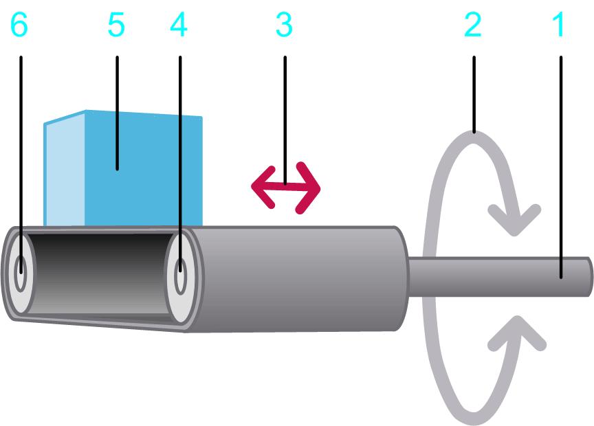

# Load Case Conveyor Belt

## Overview

The load case  Conveyor belt allows you to design conveyor belts, chains, etc. and to take them into account for drive sizing. You can take horizontal, inclined, and vertical conveyor belts into account.

## Parameters

The load case Conveyor belt  allows you to specify the parameters described in the table:

**1** Input shaft

**2** Rotary motion at the input shaft

**3** Linear movement of the load described by the motion profile

**4** Drive roll

**5** Load

**6** Driven roll

| Parameter | Description | Physical Quantity |
| --- | --- | --- |
| Diameter of the drive roll | Diameter of the roll that is connected to the motor.  The diameter of the drive roll determines the transmission ratio between the linear movement of the load and the rotary movement of the input shaft. | Length |
| Mass of the load | Mass of the material that is moved. | Mass |
| Mass of the belt | Mass of the conveyor belt. | Mass |
| Moment of inertia of the drive roll | Moment of inertia of the roll that is connected to the motor. | Moment of inertia |
| Moment of inertia of the driven roll | Moment of inertia of the driven roll.  Generally, Motion Sizer assumes that the drive roll and the driven roll have identical diameters. If the drive roll and the driven roll have different diameters, you have to take the transmission ratio into account. To achieve this, divide the inertia by the square of the roll diameter ratio by using the following equation:  J = JDriven roll / (dDriven roll / dDrive roll)2  **J**: Moment of inertia you have to calculate if the drive roll and the driven roll have different diameters.  **JDriven roll**: Moment of inertia of the driven roll.  **dDriven roll**: Diameter of the driven roll.  **dDrive roll**: Diameter of the drive roll. | Moment of inertia |
| Moment of inertia of additional rolls | Moment of inertia of additional elements such as additional rollers or deflection rollers without the inertia of the load, driving roller, driven roller. Additional rolls are not shown in the graphic above this table.  Generally, Motion Sizer assumes that the drive roll and additional rolls have identical diameters. If the drive roll and additional rolls have different diameters, you have to take the transmission ratio into account. To achieve this, divide the inertia by the square of the roll diameter ratio by using the following equation:  J = JAdditional roll / (dAdditional roll / dDrive roll)2  **J**: Moment of inertia you have to calculate if the drive roll and the additional rolls have different diameters.  **JAdditional roll**: Moment of inertia of the additional roll.  **dDriven roll**: Diameter of the additional roll.  **dDrive roll**: Diameter of the drive roll. | Moment of inertia |
| Kinetic Friction force | A torque that applies to the input shaft.  This parameter can have a positive value, or 0.  During movement (when velocity is different from 0) this torque acts opposed to the direction of the motion. The absolute value of the torque during movement is constant, independent of the velocity.  At stand-still (velocity =0), this torque does not occur.  A typical example for this type of torque is kinetic friction between solid bodies. | Force |
| Additional constant force | Static additional force at the input shaft.  A positive value or negative value, or 0, is allowed. A positive value indicates that the force applies in positive direction of the load. A negative value indicates that the force applies in negative direction of the load.  The absolute value and the direction of the force are constant and apply during motion and standstill. They are independent of the velocity.  An additional constant force is caused, for example, by a suspended load. | Force |
| Viscous friction force | Velocity-dependent additional force at the input shaft.  This parameter can have a positive value, or 0.  The absolute value of the force is proportional to the absolute value of the velocity. The direction of the force is opposed to the direction of motion.  A viscous friction force is caused by the friction of a fluid. | Force per velocity |
| Inclination angle | Inclination angle of the conveyor belt in degrees (–90°...+90°).  With a positive value, the conveyor belt is inclined in upward direction, meaning in opposite direction to the force of gravity. This increases the force required to move the load.  With a negative value, the conveyor belt is inclined in downward direction. This reduces the force required to move to load. | Angle |
| Selected motion profile | The motion profile that is used a a basis for calculations for this axis.  The motion profile of the load case Conveyor belt  describes a linear movement of the load (legend item 5 in the graphic above this table). | Linear motion |
| Selected load profile | The load profile that is used in combination with another motion diagram to define an additional load. It allows you to define a load that is exerted on a servo axis during specific sequences of motion. | Force |

EIO0000002157.05