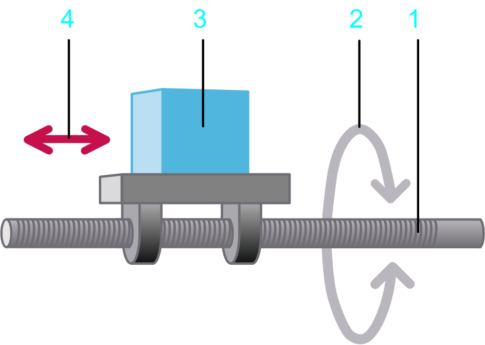

# Load Case Spindle Drive

## Overview

The load case  Spindle drive allows you to design applications that change a rotary motion into a linear motion, as, for example, for positioning slides.

## Parameters

The load case Spindle drive  allows you to specify the parameters described in the table:

**1** Spindle / input shaft

**2** Rotary motion at the input shaft

**3** Load

**4** Linear movement of the load described by the motion profile

| Parameter | Description | Physical Quantity |
| --- | --- | --- |
| Thread pitch | The pitch of a thread on the spindle drive.  The pitch of a thread on the spindle drive determines the transmission ratio between the linear movement of the load and the rotary movement of the input shaft. | Length |
| Efficiency | The degree of efficiency of the spindle. | Efficiency |
| Mass of the load | Mass of the moved load and the slide. | Mass |
| Moment of inertia of the spindle | Moment of inertia of the spindle (without a load). | Moment of inertia |
| Kinetic Friction force | A torque that applies to the input shaft.  This parameter can have a positive value, or 0.  During movement (when velocity is different from 0) this torque acts opposed to the direction of the motion. The absolute value of the torque during movement is constant, independent of the velocity.  At stand-still (velocity =0), this torque does not occur.  A typical example for this type of torque is kinetic friction between solid bodies. | Force |
| Additional constant force | Static additional force at the input shaft.  A positive value or negative value, or 0, is allowed. A positive value indicates that the force applies in positive direction of the load. A negative value indicates that the force applies in negative direction of the load.  The absolute value and the direction of the force are constant and apply during motion and standstill. They are independent of the velocity.  An additional constant force is caused, for example, by a suspended load. | Force |
| Viscous friction force | Velocity-dependent additional force at the input shaft.  This parameter can have a positive value, or 0.  The absolute value of the force is proportional to the absolute value of the velocity. The direction of the force is opposed to the direction of motion.  A viscous friction force is caused by the friction of a fluid. | Force per velocity |
| Inclination angle | Inclination angle of the spindle in degrees (–90°...+90°).  With a positive value, the spindle is inclined in upward direction, meaning in opposite direction to the force of gravity. This increases the force required to move the load.  With a negative value, the spindle is inclined in downward direction. This reduces the force required to move to load. | Angle |
| Selected motion profile | The motion profile that is used a a basis for calculations for this axis.  The motion profile of the load case Spindle drive  describes a linear movement of the load (legend item 3 in the graphic above this table). | Linear motion |
| Selected load profile | The load profile that is used in combination with another motion diagram to define an additional load. It allows you to define a load that is exerted on a servo axis during specific sequences of motion. | Force |

EIO0000002157.05