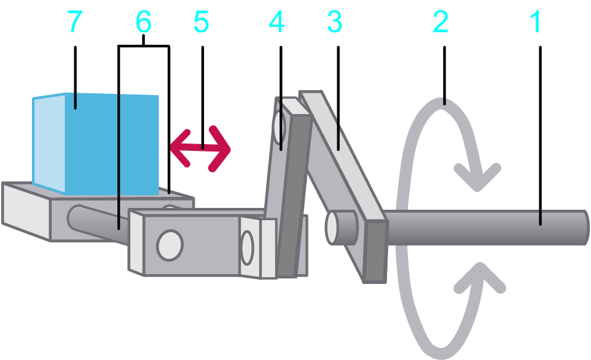
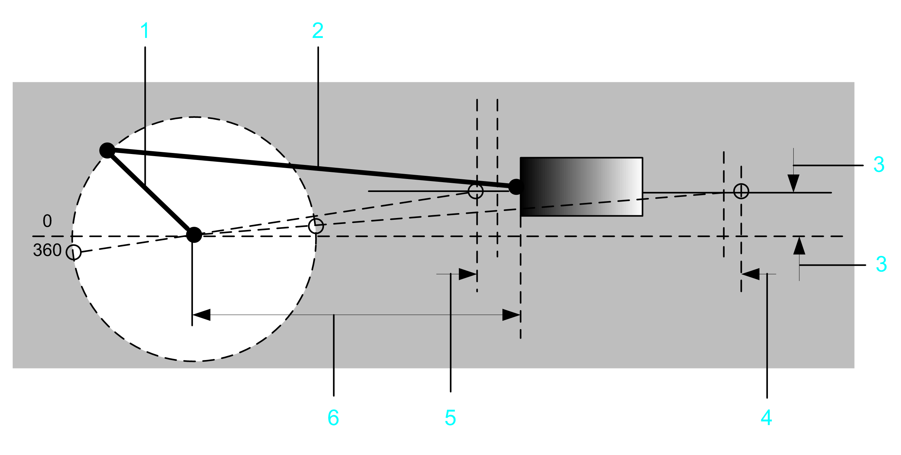

# Load Case Crank

## Overview

The load case  Crank allows you to design two types of motion by using two motion profiles:

* Motion profile of a crank mechanism representing the linear motion of the crank slide
* Motion profile of a crank mechanism representing the rotary motion of the crank shaft

## Parameters

The load case Crank allows you to specify the parameters described in the table.

Crank mechanics with linear motion:

**1** Crank / input shaft

**2** Rotary motion at the input shaft

**3** Crank arm

**4** Push rod

**5** Linear movement of the slide

**6** Slide

**7** Load

Crank mechanics with linear motion drawing illustrating the parameters:

**1** **Crank arm length**

**2** **Push rod length**

**3** **Offset from slide level to crank shaft**

**4** **Maximum position of the slide**

**5** **Minimum position of the slide**

**6** **Distance from slide zero position to crank shaft**

| Parameter | Description | Physical Quantity |
| --- | --- | --- |
| Crank arm length | The radius of the crank. | Length |
| Push rod length | The length of the connection rod between the crank and the slide. | Length |
| Distance from slide zero position to crank shaft | The distance from the crank / input shaft to the zero position of the slide. | Length |
| Offset from slide level to crank shaft | The slide is not on the same level as the center of rotation of the crank. The parameter  Offset from slide level to crank shaft  describes the difference in vertical height. | Length |
| Minimum position of the slide | The minimum x position of the slide. This value depends on the value for the parameter  Offset from slide level to crank shaft . | Length |
| Maximum position of the slide | The maximum x position of the slide.This value depends on the value for the parameter Offset from slide level to crank shaft. | Length |
| Mass of the load | Mass of the moved load. | Mass |
| Moment of inertia of the crank arm and crank shaft | The moment of inertia of the crank and the crank shaft (without the inertia of the load). | Moment of inertia |
| Kinetic Friction force | A torque that applies to the input shaft.  This parameter can have a positive value, or 0.  During movement (when velocity is different from 0) this torque acts opposed to the direction of the motion. The absolute value of the torque during movement is constant, independent of the velocity.  At stand-still (velocity =0), this torque does not occur.  A typical example for this type of torque is kinetic friction between solid bodies. | Force |
| Additional constant force | Static additional force at the input shaft.  A positive value or negative value, or 0, is allowed. A positive value indicates that the force applies in positive direction of the load. A negative value indicates that the force applies in negative direction of the load.  The absolute value and the direction of the force are constant and apply during motion and standstill. They are independent of the velocity.  An additional constant force is caused, for example, by a suspended load. | Force |
| Viscous friction force | Velocity-dependent additional force at the input shaft.  This parameter can have a positive value, or 0.  The absolute value of the force is proportional to the absolute value of the velocity. The direction of the force is opposed to the direction of motion.  A viscous friction force is caused by the friction of a fluid. | Force per velocity |
| Selected motion profile | The motion profile that is used as a basis for calculations for this axis.  The motion profiles of the load case Crank describe a linear motion of the crank slide or a rotary motion of the crank shaft. | Linear motion of the crank slide or rotary motion of the crank shaft. |
| Selected load profile | The load profile that is used in combination with another motion diagram to define an additional load. It allows you to define a load that is exerted on a servo axis during specific sequences of motion. | Force |

EIO0000002157.05