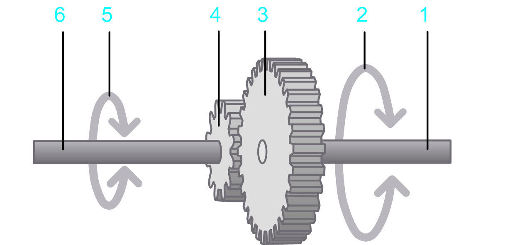

# Additional Gearbox

## Overview

The option  Additional gearbox allows you to design an additional gearbox between the motor, gear, and load.

## Parameters

The option Additional gearbox  allows you to specify the parameters described in the table:

**1** Input shaft

**2** Rotary motion at the input shaft

**3** Drive gear

**4** Driven gear

**5** Output shaft

**6** Rotary motion at the output shaft

| Parameter | Description | Physical Quantity |
| --- | --- | --- |
| Gear ratio | The ratio of the input speed of the gearbox to the output speed of the gearbox. | Ratio |
| Moment of inertia | The moment of inertia at the input of the gearbox. | Moment of inertia |
| Efficiency | The degree of efficiency of the gearbox. | Efficiency |
| Kinetic Friction Torque | A torque that applies to the input shaft.  This parameter can have a positive value, or 0.  During movement (when velocity is different from 0) this torque acts opposed to the direction of the motion. The absolute value of the torque during movement is constant, independent of the velocity.  At stand-still (velocity =0), this torque does not occur.  A typical example for this type of torque is kinetic friction between solid bodies. | Torque |
| Viscous friction torque | Velocity-dependent additional torque at the input shaft.  This parameter can have a positive value, or 0.  The absolute value of the torque is proportional to the absolute value of the velocity. The direction of the torque is opposed to the direction of motion.  A viscous friction torque is caused by the friction of a fluid. | Torque per velocity |

EIO0000002157.05