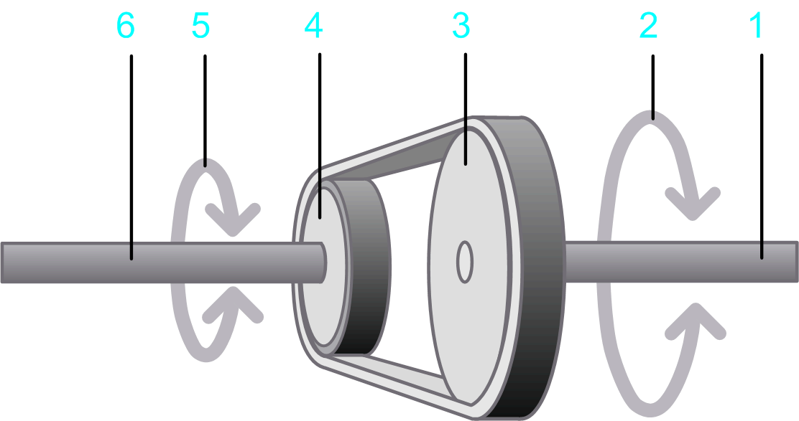

# Belt-driven Pulley

## Overview

The option  Belt-driven pulley allows you to design a flat belt drive in your application.

## Parameters

The option Belt-driven pulley  allows you to specify the parameters described in the table:

**1** Input shaft

**2** Rotary motion at the input shaft

**3** Drive pulley

**4** Driven pulley

**5** Output shaft

**6** Rotary motion at the output shaft

| Parameter | Description | Physical Quantity |
| --- | --- | --- |
| Diameter of the drive pulley | The diameter of the pulley that is connected to the motor.  The diameter of the drive pulley determines the transmission ratio. | Length |
| Moment of inertia of the drive pulley | Moment of inertia of the pulley that is connected to the motor. | Moment of inertia |
| Diameter of the driven pulley | The diameter of the pulley that is driven by the belt. | Length |
| Moment of inertia of the driven pulley | Moment of inertia of the pulley that is driven by the belt. | Moment of inertia |
| Mass of the belt | Mass of the belt. | Mass |
| Moment of inertia of additional rolls | Moment of inertia of additional elements such as additional rollers or deflection rollers without the inertia of the load, driving roller, driven roller. Additional rolls are not shown in the graphic above this table. | Moment of inertia |
| Efficiency | The degree of efficiency of the belt-driven pulley. | Efficiency |
| Kinetic Friction Torque | A torque that applies to the input shaft.  This parameter can have a positive value, or 0.  During movement (when velocity is different from 0) this torque acts opposed to the direction of the motion. The absolute value of the torque during movement is constant, independent of the velocity.  At stand-still (velocity =0), this torque does not occur.  A typical example for this type of torque is kinetic friction between solid bodies. | Torque |
| Viscous friction torque | Velocity-dependent additional torque at the input shaft.  This parameter can have a positive value, or 0.  The absolute value of the torque is proportional to the absolute value of the velocity. The direction of the torque is opposed to the direction of motion.  A viscous friction torque is caused by the friction of a fluid. | Torque per velocity |

EIO0000002157.05