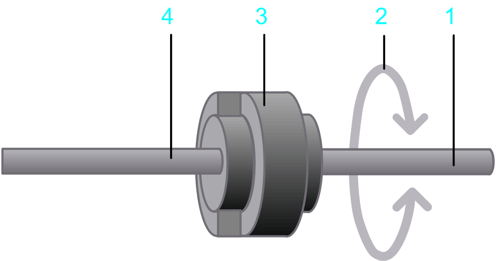

# Coupling

## Overview

The option  Coupling allows you to design a connection between motor / gear at the output shaft and the load.

## Parameters

The option Coupling  allows you to take into account the moment of inertia of the coupling:

**1** Input shaft

**2** Rotary motion at the input shaft

**3** Coupling

**4** Output shaft

| Parameter | Description | Physical Quantity |
| --- | --- | --- |
| Moment of inertia | The moment of inertia of the coupling. | Moment of inertia |

EIO0000002157.05