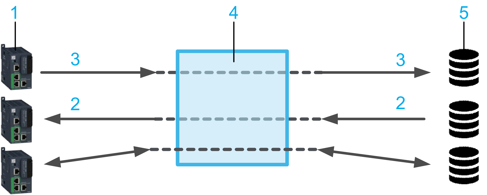

# Presentation of the SQL Gateway

## Introduction

The SQL Gateway has a central role in an SQL architecture. Since controllers, that act as SQL clients, cannot directly access an SQL database, the SQL Gateway serves as an interface to access the driver of the SQL database.

**1** 1...n controllers (SQL clients)

**2** Read data

**3** Write data

**4** SQL Gateway

**5** 1...n database servers

## Installing the SQL Gateway as Windows Service

You have to install the SQL Gateway on a PC running the Windows operating system (refer to the System Requirements hereafter) that is connected to the controllers as well as to the database servers via Ethernet. After successful installation, the SQL Gateway runs as a Windows service and can be accessed via an icon in the Windows notification area.

The icon represents different states of the SQL Gateway service:

| SQL Gateway icon | Description |
| --- | --- |
|  | The SQL Gateway service is running. |
|  | The SQL Gateway service is stopped. |

## System Requirements

The PC for SQL Gateway installation must meet the following hardware requirements:

| Equipment | Minimum | Optimal |
| --- | --- | --- |
| Processor | Intel Core(TM) 2 Duo  (or equivalent) | Intel Core(TM) I7  (or equivalent) |
| RAM | 500 MB | 1 GB |
| Free hard drive space | 500 MB including the memory space for the software installation, temporary space for execution and space for saving applications | 1 GB for the full software installation, temporary space for execution and space for saving applications |
| Peripherals | Mouse or compatible pointing device | |
| Web access | Web activation requires Internet access system. | |

The PC for SQL Gateway installation must run one of the following Windows versions:

* Microsoft Windows 8.1 Professional Edition 32 bits
* Microsoft Windows 8.1 Professional Edition 64 bits
* Microsoft Windows 10 Professional Edition 32 bits
* Microsoft Windows 10 Professional Edition 64 bits

Your programming software containing the SqlRemoteAccess library must be installed on a PC that is connected to the controllers as well as to the SQL Gateway PC via Ethernet. The SqlRemoteAccess library provides client function blocks that allow your controllers to connect to the SQL database in order to run SQL queries for reading and writing data.

NOTE: For the creation of self-signed certificates for Microsoft SQL Server connections, the MakeCert tool from Microsoft must be available on the PC.

## Licensing

A valid license is required to run the SQL Gateway.

After successful installation, the 42-days trial license is automatically activated if a permanent license is not available. To activate a permanent license, start the Schneider Electric License Manager software that is installed along with the SQL Gateway.

Information on the installed license is available in the Settings > License tab.

EIO0000002417.08