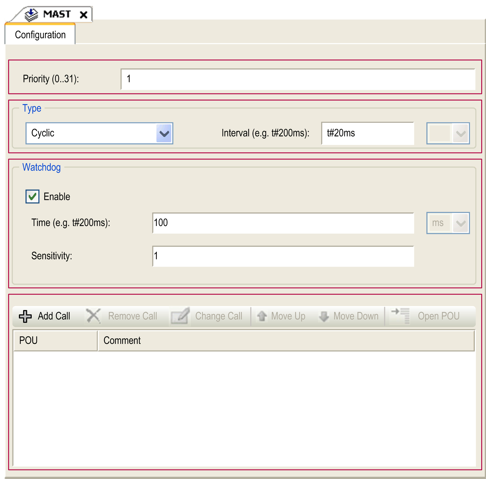

# Task Configuration Dialog

Task Configuration Dialog

Each task configuration has its own parameters which are independent of the other tasks.

The task Configuration dialog is composed of 4 parts:

The table describes the fields of the Task Configuration window:

| Field Name | Definition |
| --- | --- |
| Priority | You can configure the priority of each task with a number from 0 to 31 (0 is the highest priority, 31 is the lowest).  Only one task at a time can be running. The priority determines when the task runs:  oa higher priority task preempts a lower priority task  otasks with same priority run in turn (2 [ms](../glossary/glossary.htm#XREF_D_SE_0024697_584) time-slice)  NOTE: Do not assign tasks with the same priority. If there are yet other tasks that attempt to preempt tasks with the same priority, the result could be indeterminate and unpredictable. For more important safety information, refer to [Task Priorities](M258_-_Tasks-6.htm#XREF_D_SE_0008826_1). |
| Type | These task types are available:  o[Cyclic](M258_-_Tasks-4.htm#XREF_D_SE_0008842_3)  o[Event](M258_-_Tasks-4.htm#XREF_D_SE_0008842_16)  o[External](M258_-_Tasks-4.htm#XREF_D_SE_0008842_15)  o[Freewheeling](M258_-_Tasks-4.htm#XREF_D_SE_0008842_13) |
| Watchdog | To configure the [watchdog](M258_-_Tasks-5.htm#XREF_D_RU_0004615_3), define the following 2 parameters:  oTime: enter the timeout before watchdog execution.  oSensitivity: defines the number of expirations of the watchdog timer before the controller stops program execution and enters a HALT state. |
| POUs | The list of [POUs](../../../../../../api/crossBook?lang=en-US&virtualBookName=SoMProg&topicID=D_RU_0004939_1) (Programming Organization Units) controlled by the task is defined in the task configuration window:  oTo add a POU linked to the task, use the command Add Call and select the POU in the Input Assistant editor.  oTo remove a POU from the list, use the command Remove Call.  oTo replace the currently selected POU of the list by another one, use the command Change Call.  oPOUs are executed in the order shown in the list. To move the POUs in the list, select a POU and use the command Move Up or Move Down.  NOTE: You can create as many POUs as you want. An application with several small POUs, as opposed to one large POU, can improve the refresh time of the variables in online mode. |