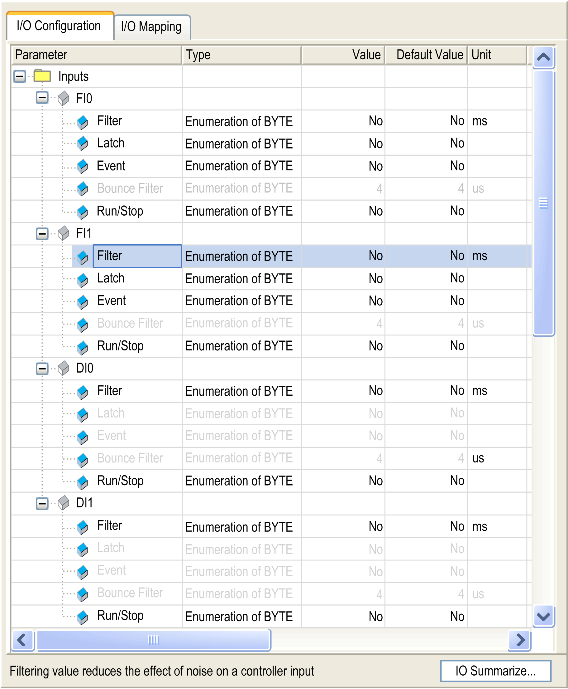
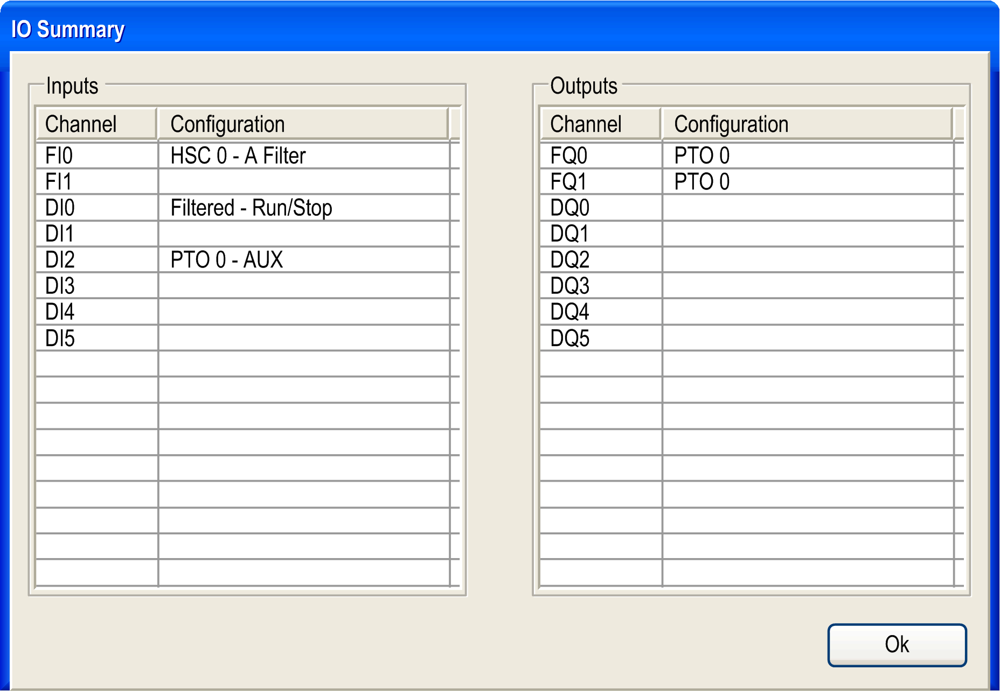

# I/O Configuration Window

I/O Configuration Window

The window allows you to configure the embedded digital inputs:

NOTE: If the selection is gray, the parameter is unavailable.

NOTE: For more information on the I/O Mapping tab, refer to the CoDeSys online help in SoMachine.

When you click the IO Summarize button, the IO Summary window appears. It allows you to check your configured I/O mapping:

