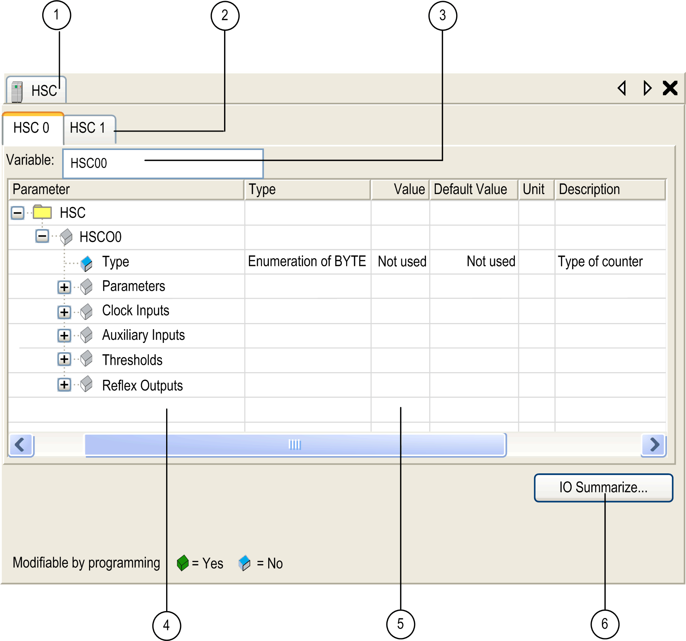

# HSC Configuration Window

HSC Configuration Window

The figure shows a sample HSC configuration window used to configure the HSC:

The table describes the areas of the HSC configuration window:

| Number | Action |
| --- | --- |
| 1 | If necessary, select the HSC tab to access the HSC configuration Windows. |
| 2 | Select a specific HSC • tab to access the HSC channel you need to configure. |
| 3 | Choose the type of HSC (Simple or Main) you want. The global variable name representing the channel instance can be defined here. Default for HSC 0 is HSC00, and for HSC 1 is HSC01. |
| 4 | Expand each parameter by clicking the plus sign next to it to access its settings. |
| 5 | Configuration window where the HSC parameters are set depending on the mode used. |
| 6 | When you click the IO Summarize button, the IO Summary window appears. It allows you to check your configured physical I/O mapping. |

For detailed information on configuration parameters, refer to [HMI SCU HSC choice matrix](../../../../../../api/crossBook?lang=en-US&virtualBookName=SCUhsc&topicID=D_SE_0031198_2).