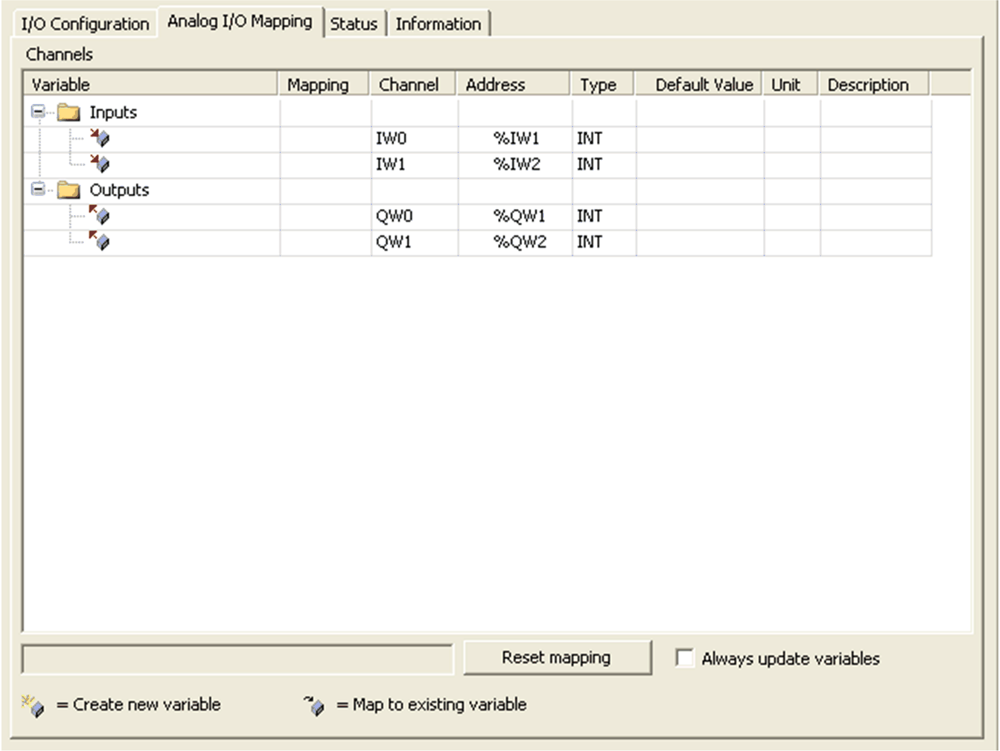

# I/O Mapping Tab

I/O Mapping Tab

Variables can be defined and named in the Analog I/O Mapping tab. Additional information such as topological addressing is also provided in this tab.

This window shows the Analog I/O Mapping tab:

The table describes the I/O mapping configuration:

| Variable | Channel | Type | Default value | Description |
| --- | --- | --- | --- | --- |
| Inputs | IW0 | INT | – | Current value of the input 0 |
| IW1 | Current value of the input 1 |
| Outputs | QW0 | INT | – | Current value of the output 0 |
| QW1 | Current value of the output 1 |