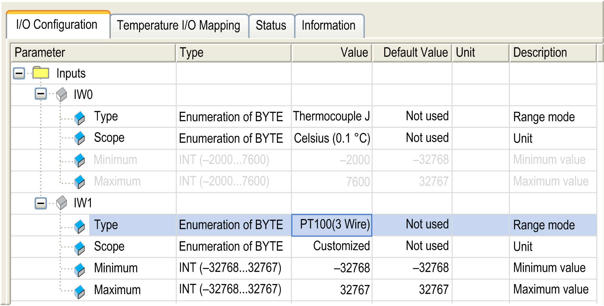

# Analog Temperature Input Configuration Window

Analog Temperature Input Configuration Window

This window allows you to configure the analog temperature inputs:

NOTE: Embedded analog I/Os are always physically updated by the MAST task.