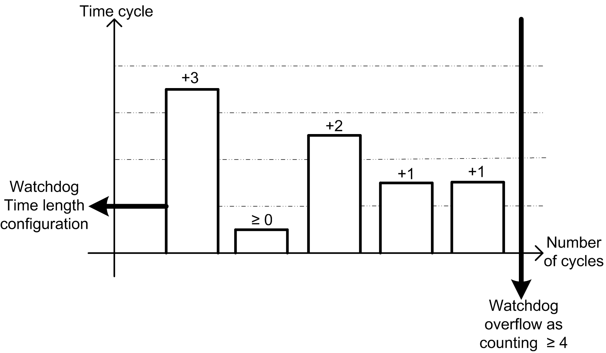

# How Do I Configure the Watchdog?

How Do I Configure the Watchdog?

You can configure the watchdog (control timer per task) using SoMachine by defining these parameters:

oTime: Set the maximum period of a given task. If the task execution time exceeds the maximum period, the watchdog is triggered.

oSensitivity: Set the number of allowed consecutive and cumulate watchdog overruns before a watchdog trigger is generated.

Depending on the Time and Sensitivity parameters, if the watchdog is triggered, the controller is stopped and goes into HALT mode. The associated task remains uncompleted, as shown in this diagram:

During a task execution, the firmware:

oResets the overtime timer if the watchdog is not triggered

oIncrements the overtime timer if the watchdog is triggered

In the following example the Sensitivity is set to 5:

