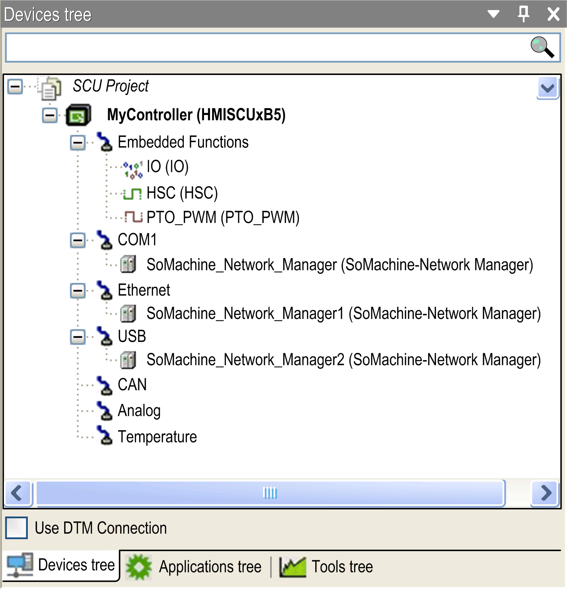

# How to Configure the Controller

How to Configure the Controller

How to Configure the HMI Controller

Introduction

First create a new project or open an existing project in the SoMachine software.

Refer to the SoMachine programming guide for information on how to:

oAdd a controller to your project.

oReplace an existing controller.

oConvert a controller to a different but compatible device.

Devices Tree

The Devices tree shows a structured view of the current hardware configuration. When you add a controller to your project, a number of nodes are automatically added to the Devices tree, depending on the functions the controller provides.

Devices tree example:

The following is accessed from the Devices tree navigator:

| Entry | | | Double-Click and Refer to... |
| --- | --- | --- | --- |
| HMISCUxx5 | | | [HMI Controller Device Editor](../M238-OH-Controller_Configuration/M238-OH-Controller_Configuration-2.htm#XREF_D_SE_0002288_1) |
|  | Embedded Functions | | |
|  | IO | [I/O Embedded Function](../HMI_SCU-OH-Embeeded_Functions_Configuration/HMI_SCU-OH-Embeeded_Functions_Configuration-2.htm#XREF_D_SE_0026223_1) configuration |
| [HSC](../glossary/glossary.htm#XREF_D_SE_0024697_574) | [HSC Embedded Function](../HMI_SCU-OH-Embeeded_Functions_Configuration/HMI_SCU-OH-Embeeded_Functions_Configuration-3.htm#XREF_D_SE_0026420_1) configuration |
| [PTO](../glossary/glossary.htm#XREF_D_SE_0024697_502)\_[PWM](../glossary/glossary.htm#XREF_D_SE_0024697_503) | [PTO\_PWM Embedded Function](../HMI_SCU-OH-Embeeded_Functions_Configuration/HMI_SCU-OH-Embeeded_Functions_Configuration-4.htm#XREF_D_SE_0031135_3) configuration |
| COM1 | | [Serial Line](../M238-OH-Serial_Line_Configuration/M238-OH-Serial_Line_Configuration-1.htm#XREF_D_SE_0003220_1) configuration |
| Ethernet(1) | | An Ethernet connection is configured via Vijeo-Designer: Property Inspector > Download > Ethernet. |
| USB(1) | | A USB connection is configured via Vijeo-Designer: Property Inspector > Download > USB. |
| CAN | | [CANopen](../HMI_SCU_-_CAN_configuration/HMI_SCU_-_CAN_configuration.htm#XREF_D_SE_0026216_1) configuration |
| Analog(2) | | [Analog I/O Embedded Function](../HMI_SCU-OH-Embeeded_Functions_Configuration/HMI_SCU-OH-Embeeded_Functions_Configuration-5.htm#XREF_D_SE_0026181_1) configuration |
| Temperature(2) | | [Analog Temperature Embedded Function](../HMI_SCU-OH-Embeeded_Functions_Configuration/HMI_SCU-OH-Embeeded_Functions_Configuration-6.htm#XREF_D_SE_0026243_1) configuration |
| (1)   For more information on how to configure the connection between your computer and the HMI controller, refer to Vijeo-Designer online help.  (2)   Only available on HMISCU6B5, HMISCU8B5 including HMI SBC. | | | |

Applications Tree

The Applications tree allows you to manage project-specific applications as well as global applications, POUs, and tasks.

Tools Tree

The Tools tree allows you to configure the HMI part of your project and to manage libraries.

EIO0000001240.06

© 2016 Schneider Electric. All rights reserved.