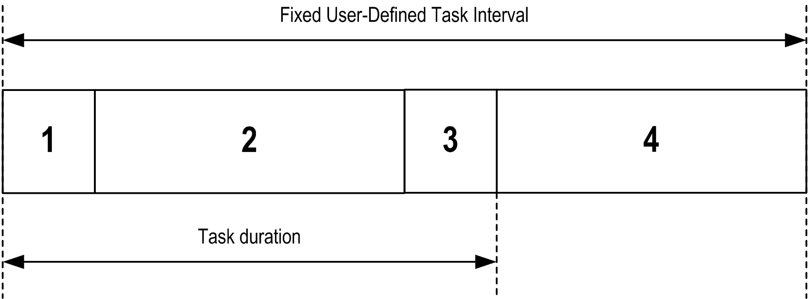
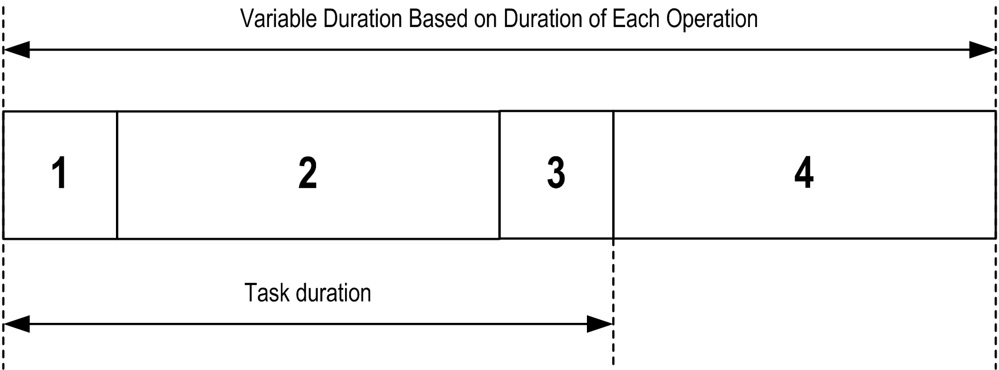

# Task Types

Task Types

Introduction

The following section describes the various [task](../glossary/glossary.htm#XREF_D_SE_0024697_175) types available for your program, along with a description of the task type characteristics.

Cyclic Task

A Cyclic task is assigned a fixed cycle time using the Interval setting in the Type section of Configuration subtab for that task. Each Cyclic task type executes as follows:

1. Read Inputs: The physical input states are written to the %I input memory variables and other system operations are executed.

2. Task Processing: The user code (POU, and so on) defined in the task is processed. The %Q output memory variables are updated according to your application program instructions but not yet written to the physical outputs during this operation.

3. Write Outputs: The %Q output memory variables are modified with any output forcing that has been defined; however, the writing of the physical outputs depends upon the type of output and instructions used.

For more information on defining the [bus cycle task](../../../../../../api/crossBook?lang=en-US&virtualBookName=SoMProg&topicID=D_SE_0031100_1), refer to the SoMachine Programming Guide and Magelis SCU HMI Controller Settings.

For more information on I/O behavior, refer to [Controller States Detailed Description](../xx_Controller_States_and_Behavior/xx_Controller_States_and_Behavior-3.htm#XREF_D_SE_0008934_1).

4. Remaining Interval time: The controller [firmware](../glossary/glossary.htm#XREF_D_SE_0024697_707) carries out system processing and any other lower priority tasks.

NOTE: If you define too short a period for a cyclic task, it will repeat immediately after the write of the outputs and without executing other lower priority tasks or any system processing. This will affect the execution of all tasks and cause the controller to exceed the system watchdog limits, generating a system watchdog exception.

NOTE: The task cycle time is set to a value greater than or equal to 4 ms and the task interval is a multiple of 4 ms.

NOTE: Get and set the interval of a Cyclic Task by application using the GetCurrentTaskCycle and SetCurrentTaskCycle function. (Refer to Toolbox Advance Library Guide for further details.)

Freewheeling Task

A Freewheeling task does not have a fixed duration. In Freewheeling mode, each task scan begins when the previous scan has been completed and after a short period of system processing. Each Freewheeling task type executes as follows:

1. Read Inputs: The physical input states are written to the %I input memory variables and other system operations are executed.

2. Task Processing: The user code (POU, and so on) defined in the task is processed. The %Q output memory variables are updated according to your application program instructions but not yet written to the physical outputs during this operation.

3. Write Outputs: The %Q output memory variables are modified with any output forcing that has been defined; however, the writing of the physical outputs depends upon the type of output and instructions used.

For more information on defining the [bus cycle task](../../../../../../api/crossBook?lang=en-US&virtualBookName=SoMProg&topicID=D_SE_0031100_1), refer to the SoMachine Programming Guide and Magelis SCU HMI Controller Settings.

For more information on I/O behavior, refer to [Controller States Detailed Description](../xx_Controller_States_and_Behavior/xx_Controller_States_and_Behavior-3.htm#XREF_D_SE_0008934_1).

4. System Processing: The controller firmware carries out system processing and any other lower priority tasks (for example: HTTP management, [Ethernet](../glossary/glossary.htm#XREF_D_SE_0024697_693) management, parameters management).

Event Task

This type of task is event-driven and is initiated by a program variable. It starts at the rising edge of the boolean variable associated to the trigger event unless pre-empted by a higher priority task. In that case, the Event task will start as dictated by the task priority assignments.

| Step | Action |
| --- | --- |
| 1 | Double-click the TASK in the Applications tree. |
| 2 | Select Event from the Type list in the Configuration tab. |
| 3 | Click the Input Assistant button G-SE-0029549.2.gif-high.gif to the right of the Event field.  Result: The Input Assistant window appears. |
| 4 | Navigate in the tree of the Input Assistant dialog box to find and assign the my\_Var variable. |

NOTE: The maximum frequency admissible for the event triggering an Event task is governed by the priorities of other tasks and system processes. So you must test your application to ensure reliable event triggering.

External Event Task

This type of task is event-driven and is initiated by the detection of a hardware or hardware-related function event. It starts when the event occurs unless pre-empted by a higher priority task. In that case, the External Event task will start as dictated by the task priority assignments.

For example, an External Event Task can be associated with an HSC Threshold cross event. To associate the HSC0\_TH1 event to an External Event task, select it from the External event drop-down list on the Configuration sub-tab.

For the Magelis HMI SCU controller, there are 2 types of events that can be associated with an External Event Task:

oa FAST input (FI0 and FI1) on a rising edge, falling edge, or both edges

oan HSC threshold when counting up, counting down, or both counting up and down

External Event Task: Performance

For an External Event Task triggered by FI0, FI1, HSC0\_TH0, or HSC0\_TH1, the minimum stable interval between triggers is:

o1.5 ms for tasks that do not require an immediate state change to FAST outputs (FQ0 or FQ1)

o15 ms for tasks that require an immediate state change to FAST outputs (FQ0 or FQ1)

If the triggering conditions are met, but at a shorter interval than listed above, External Event Task execution will be subject to delays, or may not execute. Complex tasks that require more computational time than the above times may also lead to External Event Tasks being subject to delays or missed execution.

|  |
| --- |
| Warning_Color.gifWARNING |
| UNINTENDED EQUIPMENT OPERATION |
| Test your application thoroughly to ensure that your application performance meets your specifications. |
| Failure to follow these instructions can result in death, serious injury, or equipment damage. |

EIO0000001240.06

© 2016 Schneider Electric. All rights reserved.