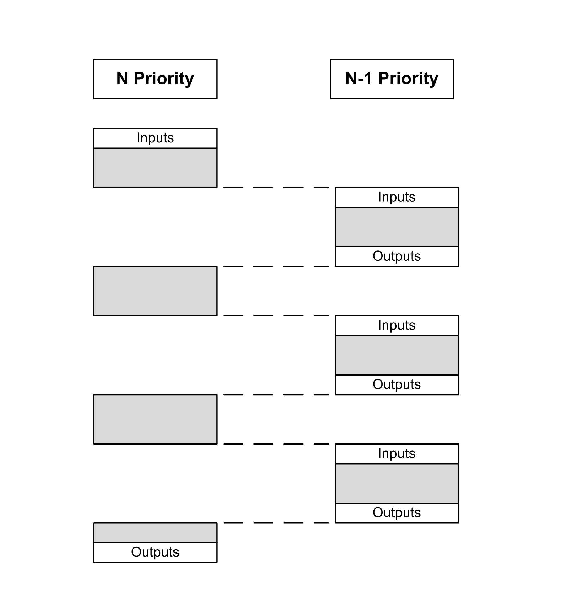

# Task Priorities

Task Priorities

Task Priority Configuration

You can configure the priority of each task between 0 and 31 (0 is the highest priority, 31 is the lowest). Each task must have a unique priority. If you assign the same priority to more than one task, execution for those tasks is indeterminate and unpredictable, which may lead to unintended consequences.

|  |
| --- |
| Warning_Color.gifWARNING |
| UNINTENDED EQUIPMENT OPERATION |
| Do not assign the same priority to different tasks. |
| Failure to follow these instructions can result in death, serious injury, or equipment damage. |

Task Priority Suggestions

oPriority 0 to 24: Controller tasks. Assign these priorities to tasks with a high availability requirement.

oPriority 25 to 31: Background tasks. Assign these priorities to tasks with a low availability requirement.

Task Preemption Due to Task Priorities

When a task cycle starts, it can interrupt any task with lower priority (task preemption). The interrupted task will resume when the higher priority task cycle is finished.

NOTE: If the same input is used in different tasks the input image may change during the task cycle of the lower priority task.

To improve the likelihood of proper output behavior during multitasking, a message is displayed if outputs in the same byte are used in different tasks.

|  |
| --- |
| Warning_Color.gifWARNING |
| UNINTENDED EQUIPMENT OPERATION |
| Map your inputs so that tasks do not alter the input images in an unexpected manner. |
| Failure to follow these instructions can result in death, serious injury, or equipment damage. |

EIO0000001240.06

© 2016 Schneider Electric. All rights reserved.