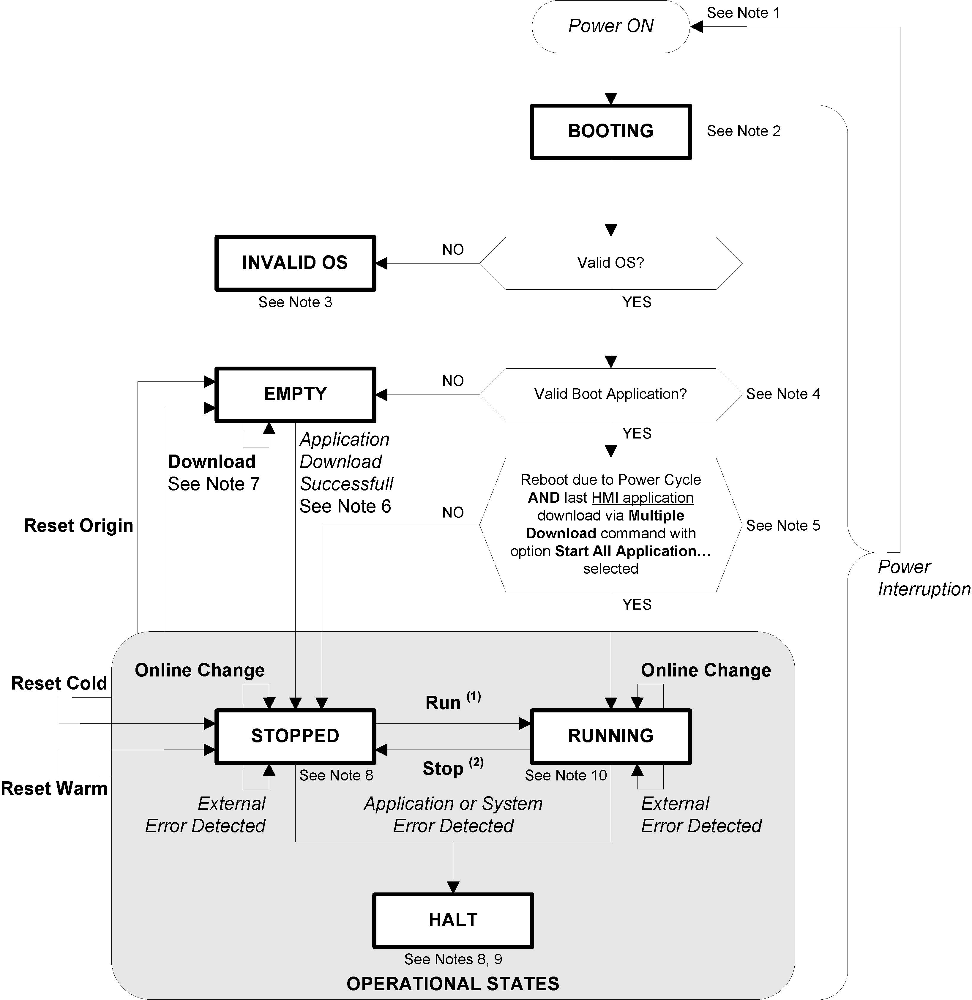

# HMI Controller State Diagram

HMI Controller State Diagram

Controller State Diagram

Controller State Diagram

The following diagram describes the controller operating mode:

Legend:

oController states are indicated in ALL-CAPS BOLD

oUser and application commands are indicated in Bold

oSystem events are indicated in Italics

oDecisions, decision results and general information are indicated in normal text

(1) For details on STOPPED to RUNNING state transition, refer to [Run Command](xx_Controller_States_and_Behavior-6.htm#XREF_D_SE_0008938_2).

(2) For details on RUNNING to STOPPED state transition, refer to [Stop Command](xx_Controller_States_and_Behavior-6.htm#XREF_D_SE_0008938_8).

Note 1

The Power Cycle (Power Interruption followed by a Power ON) deletes all output forcing settings. Refer to Controller State and Output Behavior for further details.

Note 2

The outputs will assume their initialization states.

Note 3

HMI download screen is displayed prompting the user to download the firmware, HMI and Control application.

Note 4

The application is loaded into RAM after verification of a valid [Boot application](../glossary/glossary.htm#XREF_D_SE_0024697_640).

Note 5

The state of the controller will be RUNNING after a reboot if the reboot was provoked by a Power Cycle and the HMI application had been downloaded using a Multiple Download... command with option Start all applications after download or online change selected.

Note 6

During a successful application download the following events occur:

oThe application is loaded directly into RAM.

oBy default, the Boot application is created and saved into the Flash memory.

Note 7

However, there are two important considerations in this regard:

oOnline Change: An online change (partial download) initiated while the controller is in the RUNNING state returns the controller to the RUNNING state if successful.

Before using the Login with online change option, test the changes to your application program in a virtual or non-production environment and confirm that the controller and attached [equipment](../glossary/glossary.htm#XREF_D_SE_0024697_690) assume their expected conditions in the RUNNING state.

|  |
| --- |
| Warning_Color.gifWARNING |
| UNINTENDED EQUIPMENT OPERATION |
| Always verify that online changes to a RUNNING application program operate as expected before downloading them to controllers. |
| Failure to follow these instructions can result in death, serious injury, or equipment damage. |

NOTE: Online changes to your program are not automatically written to the Boot application, and will be overwritten by the existing Boot application at the next reboot. If you wish your changes to persist through a reboot, manually update the Boot application by selecting Create boot application in the Online menu.

oMultiple Download: SoMachine has a feature that allows you to perform a full application download to multiple targets on your [network](../glossary/glossary.htm#XREF_D_SE_0024697_152) or fieldbus.

One of the default options when you select the Multiple Download... command is the Start all applications after download or online change option, which restarts all download targets in the RUNNING state, irrespective of their last controller state before the multiple download was initiated. Deselect this option if you do not want all targeted controllers to restart in the RUNNING state.

In addition, before using the Multiple Download... option, test the changes to your application program in a virtual or non-production environment and confirm that the targeted controllers and attached equipment assume their expected conditions in the RUNNING state.

|  |
| --- |
| Warning_Color.gifWARNING |
| UNINTENDED EQUIPMENT OPERATION |
| Always verify that your application program will operate as expected for all targeted controllers and equipment before issuing the Multiple Download… command with the Start all applications after download or online change option selected. |
| Failure to follow these instructions can result in death, serious injury, or equipment damage. |

Note 8

The SoMachine software platform allows many powerful options for managing task execution and output conditions while the controller is in the STOPPED or HALT states. Refer to Controller State and Output Behavior for further details.

Note 9

To exit the HALT state it is necessary to issue one of the Reset commands (Reset Warm, Reset Cold, Reset Origin), download an application or cycle power.

In the event a Hardware Watchdog is triggered, an automatic reboot into Ready for Download mode occurs. In this state, the HMI application and the controller application are not loaded. The device can be recovered by downloading new HMI and controller applications.

Note 10

The RUNNING state has two exceptional conditions that will be indicated in run state or error messages on HMI screen.

oRUNNING with External Error: You may exit this exceptional condition by clearing the external error. No controller commands are required.

oRUNNING with Breakpoint: Refer to [Controller State Description](xx_Controller_States_and_Behavior-3.htm#XREF_D_SE_0008934_1) for further details on this exceptional condition.

EIO0000001240.06

© 2016 Schneider Electric. All rights reserved.