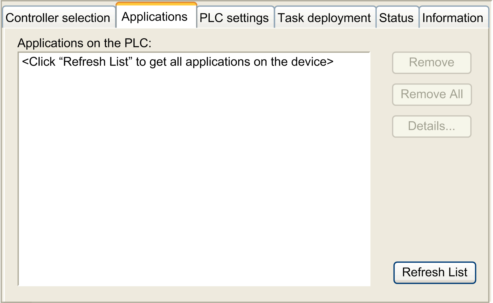

# Controller Parameters

Controller Parameters

Controller Parameters

To open the device editor, double-click HMISCUxx5 in the [Devices tree](../M2xx_-_How_to_Configure_the_Controller/M2xx_-_How_to_Configure_the_Controller.htm#XREF_D_SE_0026177_6):

Tabs Description

| Tab | Description | Restriction |
| --- | --- | --- |
| [Controller selection](M238-OH-Controller_Configuration-3.htm#XREF_D_SE_0035606_1) | Manages the connection from PC to the controller:  ohelping you find a controller in a network,  opresenting the list of available controllers, so you can connect to the selected controller and manage the application in the controller,  ohelping you physically identify the controller from the device editor,  ohelping you change the communication settings of the controller. | Online mode only |
| Applications | Presents the application running on the controller and allows removing the application from the controller. | Online mode only |
| [PLC settings](M238-OH-Controller_Configuration-5.htm#XREF_D_SE_0006801_1) | Configuration of:  oapplication name  oI/O behavior in stop  obus cycle options | – |
| Task deployment | Displays a list of I/Os and their assignments to tasks. | After compilation only |
| Status | Displays device-specific status and diagnostic messages. | – |
| Information | Displays general information about the device (name, description, provider, version, image). | – |

EIO0000001240.06

© 2016 Schneider Electric. All rights reserved.