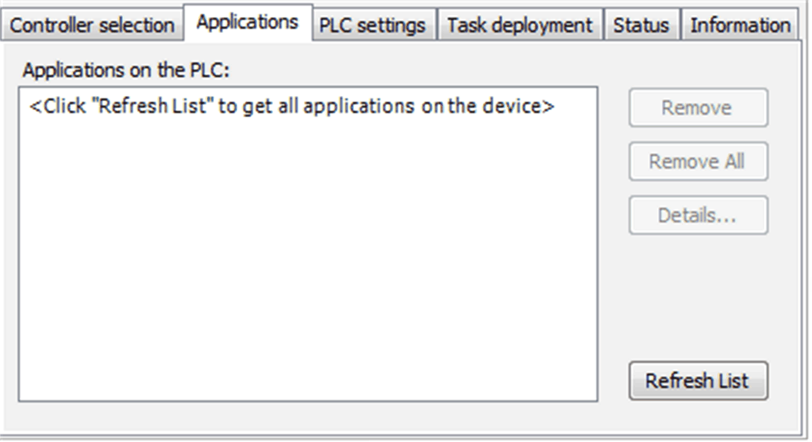

# Applications

Applications

Overview

The Applications view of the device editor serves to scan and to remove applications on the controller. Information on the content of the application can be available as well as some details on the application properties.

Applications view of the device editor:

The Applications view provides the following elements:

| Element | | Description |
| --- | --- | --- |
| Applications on the PLC | | List of the names of applications, which have been found on the controller during the last scan.  NOTE: SoMachine controllers currently support only one application in a device at a time. |
| Buttons | Remove | The application currently selected in the list is removed from the controller. |
| Remove all | All applications are removed from the controller. |
| Refresh List | The controller is scanned for applications and the list is updated. |

EIO0000001240.06

© 2016 Schneider Electric. All rights reserved.