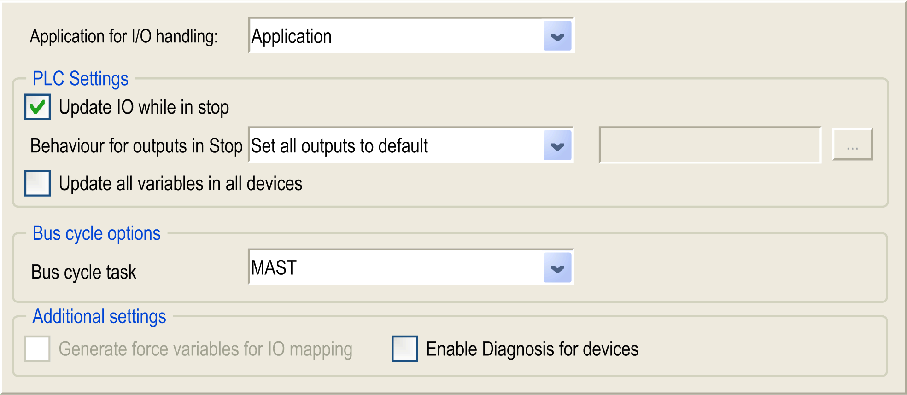

# PLC Settings

PLC Settings

Overview

The figure below presents the PLC Settings tab:

| Element | | Description |
| --- | --- | --- |
| Application for I/O handling | | By default, set to Application because there is only one application in the controller. |
| PLC settings | Update IO while in stop | If this option is activated (default), the values of the input and output channels get also updated when the controller is stopped. |
| Behavior for outputs in Stop | From the selection list, choose one of the following options to configure how the values at the output channels should be handled in case of Controller stop:  oKeep current values: The current values will not be modified.  oSet all outputs to default: The default (fallback) values resulting from the mapping will be assigned.  NOTE: This option is not taken into account for the outputs used by the HSC, PTO, or PWM. |
| Update all variables in all devices | If this option is activated, then for all devices of the current controller configuration all I/O variables will get updated in each cycle of the bus cycle task. This corresponds to the option Always update variables, which can be set separately for each device in the I/O Mapping dialog. |
| Bus cycle options | Bus cycle task | This configuration setting is the parent for all Bus cycle task parameters used in the application device tree.  Some devices with cyclic calls, such as a CANopen manager, can be attached to a specific task. In the device, when this setting is set to Use parent bus cycle setting, the setting set for the controller is used.  The selection list offers all tasks currently defined in the active application. The default setting is the MAST task.  NOTE: <unspecified> means that the task is in "slowest cyclic task" mode. |
| Additional settings | Generate force variables for IO mapping | Not used. |
| Enable Diagnosis for devices | Not used. |

EIO0000001240.06

© 2016 Schneider Electric. All rights reserved.