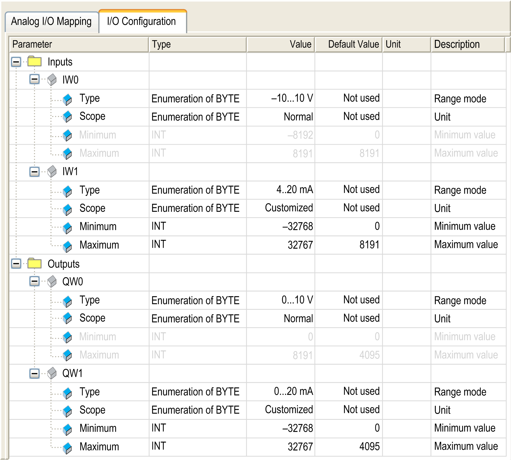

# Analog I/O Embedded Function

Analog I/O Embedded Function

Overview

The HMISCUxB5 HMI controllers have embedded analog I/O:

o2 analog inputs

o2 analog outputs

For information about the technical characteristics of the analog I/O, refer to the [Hardware Guide](../../../../../../api/crossBook?lang=en-US&virtualBookName=SCUhw&topicID=D_SE_0024616_1).

Accessing the Analog I/O Configuration Window

| Step | Description |
| --- | --- |
| 1 | Click HMISCUxx5 > Embedded Functions > Analog. |
| 2 | Select the I/O Configuration tab. |

Analog I/O Configuration Window

This window allows you to configure the analog I/O:

NOTE:  The parameter is unavailable if the selection displays as gray in color.

NOTE: Embedded analog I/Os are always physically updated by the MAST task.

I/O Configuration Tab

To configure the HMI SCU, select the I/O Configuration tab.

The table describes the analog parameters configuration:

| Parameter | | Value | Description | Constraint |
| --- | --- | --- | --- | --- |
| Type | | Not used \*  – 10...10 V  0...10 V  0...20 mA  4...20 mA | Range mode | – |
| Scope | | Normal \*  Customized | Unit | Available if Type value is defined. |
| Minimum | Normal  Analog input | – 10...10 V: – 8192  0...10 V: 0  0...20 mA: 0  4...20 mA: 0 | Minimum value | Not configurable. |
| Normal  Analog output | – 10...10 V: – 2048  0...10 V: 0  0...20 mA: 0  4...20 mA: 0 | Not configurable. |
| Customized  Analog I/O | – 10...10 V: – 32768  0...10 V: – 32768  0...20 mA: – 32768  4...20 mA: – 32768 | Inferior that the configured maximum. Configured minimum must be less than the configured maximum. |
| Maximum | Normal  Analog input | – 10...10 V: 8191  0...10 V: 16383  0...20 mA: 16383  4...20 mA: 16383 | Maximum value | Not configurable. |
| Normal  Analog output | – 10...10 V: 2047  0...10 V: 4095  0...20 mA: 4095  4...20 mA: 4095 | Not configurable. |
| Customized  Analog I/O | – 10...10 V: 32767  0...10 V: 32767  0...20 mA: 32767  4...20 mA: 32767 | Superior that the configured minimum. Configured maximum must be more than the configured minimum. |
| \*   parameter default value | | | | |

If you have physically wired the analog channel for a voltage signal and you configure the channel for a current signal in SoMachine, you may damage the analog circuit.

|  |
| --- |
| NOTICE |
| INOPERABLE EQUIPMENT |
| Verify that the physical wiring of the analog circuit is compatible with the software configuration for the analog channel. |
| Failure to follow these instructions can result in equipment damage. |

Analog to Digital Conversion Rate

Analog-to-digital conversion rate for data acquisition is made using the converter hardware. All analog I/O that are configured are converted every 2 ms.

I/O Mapping Tab

Variables can be defined and named in the Analog I/O Mapping tab. Additional information such as topological addressing is also provided in this tab.

This window shows the Analog I/O Mapping tab:

The table describes the I/O mapping configuration:

| Variable | Channel | Type | Default value | Description |
| --- | --- | --- | --- | --- |
| Inputs | IW0 | INT | – | Current value of the input 0 |
| IW1 | Current value of the input 1 |
| Outputs | QW0 | INT | – | Current value of the output 0 |
| QW1 | Current value of the output 1 |

EIO0000001240.06

© 2016 Schneider Electric. All rights reserved.