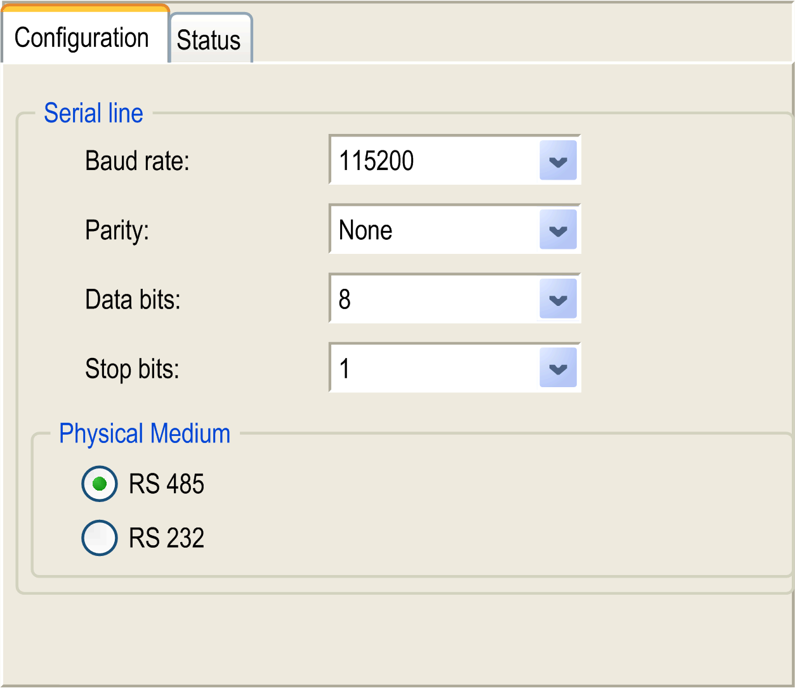

# Serial Line Configuration

Serial Line Configuration

Introduction

The serial line Configuration window allows configuring the physical parameters of the serial line (baud rate, parity, and so on).

The Serial Line port(s) of your controller are configured for the SoMachine protocol by default when new or when you update the controller firmware. The SoMachine protocol is incompatible with other protocols such as that of Modbus Serial Line.

In an active Modbus configured serial line, if a new controller is connected or if controller firmware is updated, this can cause the other devices available on the serial line to stop communicating.

Check that the controller is not connected to an active Modbus serial line network before downloading a valid application having the concerned port or ports properly configured for the intended protocol.

|  |
| --- |
| Warning_Color.gifWARNING |
| UNINTENDED EQUIPMENT OPERATION |
| Verify that your application has the Serial Line port(s) properly configured for Modbus before physically connecting the controller to an operational Modbus serial line network. |
| Failure to follow these instructions can result in death, serious injury, or equipment damage. |

Access to Serial Line Configuration

To configure the serial line, proceed as follows:

| Step | Action |
| --- | --- |
| 1 | Click HMISCUxx5 > COM1 in the Devices tree. |
| 2 | Click the Configuration tab. |

Serial Line Configuration

The Configuration tab is displayed:

The following parameters must be identical for each serial device connected to the port:

| Element | Description |
| --- | --- |
| Baud rate | Transmission speed in bits/s |
| Parity | Used for error detection |
| Data bits | Number of bits for transmitting data |
| Stop bits | Number of stop bits |
| Physical medium | Specify to use RS-232 or RS-485 |

The serial line ports of your controller are configured for the SoMachine protocol by default when new or when you update the controller firmware. The SoMachine protocol is incompatible with that of other protocols such as Modbus Serial Line. Connecting a new controller to, or updating the firmware of a controller connected to, an active Modbus configured serial line can cause the other devices on the serial line to stop communicating. Make sure that the controller is not connected to an active Modbus serial line network before first downloading a valid application having the concerned port or ports properly configured for the intended protocol.

|  |
| --- |
| NOTICE |
| INTERRUPTION OF SERIAL LINE COMMUNICATIONS |
| Be sure that your application has the serial line ports properly configured for Modbus before physically connecting the controller to an operational Modbus Serial Line network. |
| Failure to follow these instructions can result in equipment damage. |

This table indicates the maximum baud rate value of the managers:

| Manager | Maximum Baud Rate (Bits/S) |
| --- | --- |
| SoMachine Network Manager | 115200 |
| Modbus Manager |

EIO0000001240.06

© 2016 Schneider Electric. All rights reserved.