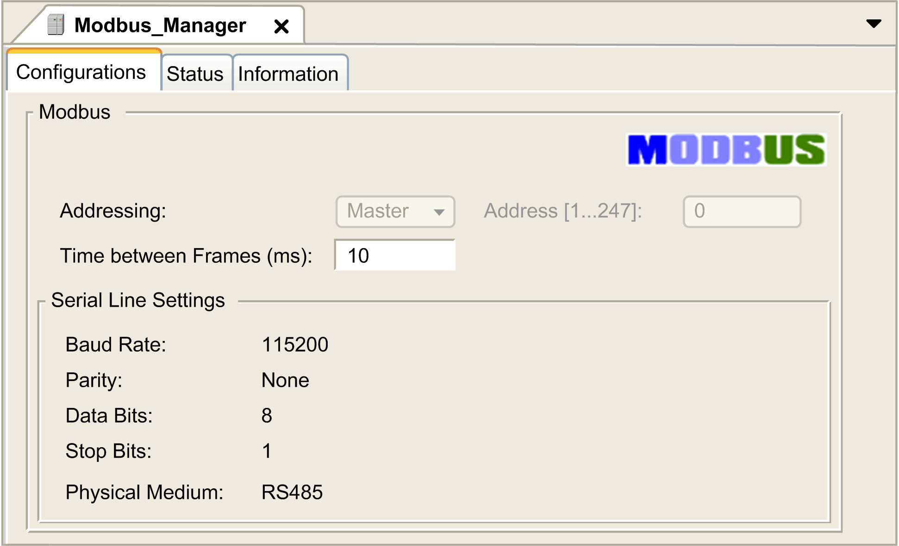

# Modbus Manager

Modbus Manager

Introduction

The Modbus Manager is used for Modbus RTU protocol in the master mode.

Adding the Manager

To add a Modbus Manager to your controller, click the Plus Button  next to the COM1 node in the Devices Tree. In the Add Device window, select Modbus Manager and click the Add Device button.

Modbus Manager Configuration

To configure the Modbus Manager of your controller, double-click Modbus Manager in the Devices tree.

The Modbus Manager configuration window is displayed as below:

Set the parameters as described in the following table:

| Element | Description |
| --- | --- |
| Addressing | The HMI SCU is configured as a master. No other options are available. |
| Address [1...247] | Modbus address of the device. For Modbus master, this is set to 0. |
| Time between Frames (ms) | Time to avoid bus-collision.  Set this parameter to identical values for each Modbus device on the link. |
| Serial Line Settings | Parameters specified in the [Serial Line configuration window](M238-OH-Serial_Line_Configuration-2.htm#XREF_D_SE_0027205_1). |

NOTE: On HMISCU, Modbus request function blocks from the PLC Communication Library require a specific Time between Frames based on the Baud Rate in order for communication at lower baud rates. Use the following formula to determine a suitable Baud Rate/Time between Frames combination:

Time between Frames (rounded up to the nearest millisecond) = 35000 / baud rate.

Modbus Master

When the controller is configured as a Modbus Master, the following function blocks are supported from the PLCCommunication Library:

oADDM

oREAD\_VAR

oSINGLE\_WRITE

oWRITE\_READ\_VAR

oWRITE\_VAR

For further information, see [Function Block Descriptions](../../../../../../api/crossBook?lang=en-US&virtualBookName=m2xxcom&topicID=D_SE_0002235_1) of the [PLCCommunication Library](../../../../../../api/crossBook?lang=en-US&virtualBookName=m2xxcom&topicID=D_SE_0002214_1).

EIO0000001240.06

© 2016 Schneider Electric. All rights reserved.