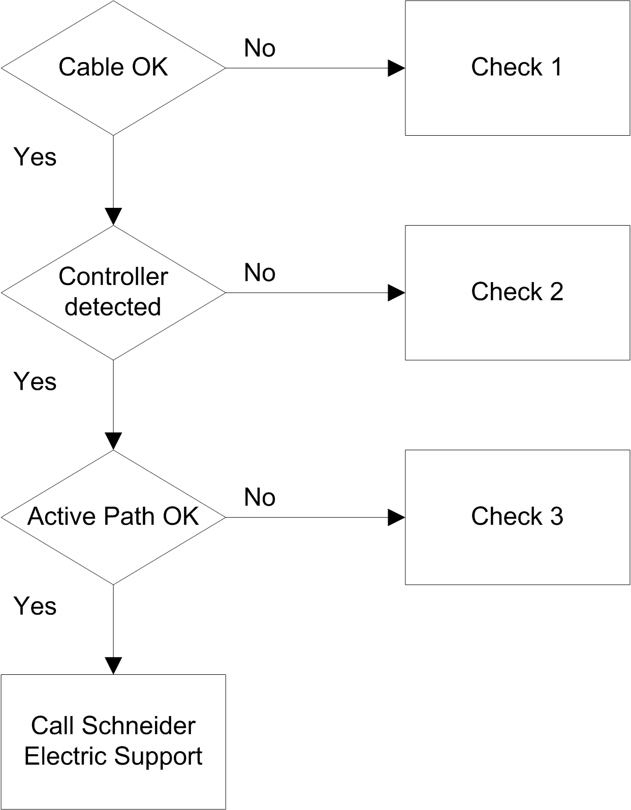

# Troubleshooting

Troubleshooting

Introduction

This section lists the possible troubleshooting solutions with the HMI SCU, and procedures for troubleshooting them.

Transferring the Application is not Possible

Possible causes:

oPC cannot communicate with the controller.

oSoMachine not configured for the current connection.

oIs your application valid?

oIs the CoDeSys gateway running?

oIs the CoDeSys SP win running?

Resolution:

oRefer to [Communication between SoMachine and the HMI SCU](#XREF_D_SA_0027337_3).

oYour application program must be valid. Refer to the [debugging](../../../../../../api/crossBook?lang=en-US&virtualBookName=SoMProg&topicID=D_SE_0031533_1) section for more information.

oThe CoDeSys gateway must be running:

a.click the CoDeSys Gateway icon in the task bar,

b.select Start Gateway.

Communication Between SoMachine and the HMI SCU is not Possible.

Possible causes:

oSoMachine not configured for the current connection.

oIncorrect cable usage.

oController not detected by the PC.

oCommunication settings are not correct.

oThe controller has detected an error or its firmware is invalid.

Resolution: Follow the flowchart below for troubleshooting purposes and then refer to the next table:

| Check | Action |
| --- | --- |
| 1 | Verify that:  oThe cable is correctly linked to the controller and to the PC, and is not damaged,  oYou used the specific cable or adapter, depending on the connection type:  oEthernet and Serial link connection.  oXBTZG935 cable for a USB connection.  oXBTZG935 and XBTZGUSB or TCSXCNAMUM3P and XBTZGUSBB connection when the controller is mounted on a front panel. |
| 2 | Verify that the HMI SCU has been detected by your PC:  1.Click Start > Control Panel > System, then select the Hardware tab and click Device Manager,  2.  G-SA-0046148.3.gif-high.gif  Verify that the HMI SCU node appears in the list, as shown below:  3.If the HMI SCU node does not appear, or if there is an G-SA-0045289.2.gif-high.gif icon in front of the node, disconnect and reconnect the cable on the controller side. |
| 3 | Verify that the active path is correct:  1.Double-click the controller node in the device view.  2.Verify that the HMI SCU node appears in bold, not in italic.  If not:  a.Stop the CoDeSys Gateway: right-click the icon in the task bar and select Stop Gateway.  b.Disconnect and reconnect the cable on the controller side.  c.Start the CoDeSys Gateway: right-click the icon in the task bar and select Start Gateway.  d.Select the gateway in the controller window of SoMachine and click Scan network. Select the HMI SCU node and click Set active path.  NOTE: If your PC is connected to an Ethernet network, its address might have changed. In this case, the currently set active path is no longer correct and the HMI SCU node appears in italics. Select the HMI SCU node and click Resolve Name. If the node no longer appears in italics, click Set Active Path to correct this. |

Application Does Not Go to RUN State

Possible causes:

oNo POU declared in the task.

oControllerLockout activated.

Resolution:

As POUs are managed by tasks, add a POU to a task:

1.Double-click a task in the Applications tree.

2.Click the Add Call button in the task window.

3.Select the POU you want to execute in the Input Assistant window and click OK.

4.Unlock ControllerLockout in Vijeo Designer.

Creating the Boot Application is not Possible

Possible cause:

Operation not possible while the controller is in RUN state.

Resolution:

oSelect Stop Application.

oSelect Create Boot Project.

Changing Device Name does not work

Possible cause:

Application is running.

Resolution:

oSelect Stop Application,

oChange device name.

CANopen Heartbeat is not sent on a regular basis

Possible cause:

Heartbeat value is not correct.

Resolution:

The Heartbeat of the CANopen master must be reset:

oCalculate the Heartbeat consumer time:

Heartbeat Consumer Time = Producer Time \* 1.5

oUpdate the Heartbeat value

Monitoring of the POU is slow

Possible cause:

oTask interval is too small or POU is too big.

oConnection speed low between controller and device (over serial connection).

Resolution:

oIncrease the configured task interval.

oSplit the application into smaller POUs.

Out of Memory appears on the HMI screen

Possible cause:

oThe number of variables and symbols shared between the controller and the HMI is too high.

Resolution:

oDecrease the number of variables and symbols shared between the controller and the HMI.

oPower cycle the HMI.

EIO0000001240.06

© 2016 Schneider Electric. All rights reserved.