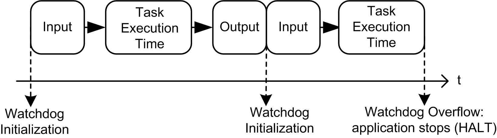

# Frequently Asked Questions

Frequently Asked Questions

What Programming Languages Are Supported by a HMI SCU?

These languages are supported:

oContinuous Function Chart ([CFC](../glossary/glossary.htm#XREF_D_SE_0024697_652))

oFunction Block Diagram ([FBD](../glossary/glossary.htm#XREF_D_SE_0024697_702))

oInstruction List ([IL](../glossary/glossary.htm#XREF_D_SE_0024697_443))

oLadder Logic Diagram ([LD](../glossary/glossary.htm#XREF_D_SE_0024697_79))

oSequential Function Chart ([SFC](../glossary/glossary.htm#XREF_D_SE_0024697_449))

oStructured Text ([ST](../glossary/glossary.htm#XREF_D_SE_0024697_57))

What Variable Types Are Supported by an HMI SCU Controller?

Refer to the Supported Variables section.

Can I Use the SoMachine Network to Communicate with Equipment Connected to the Serial Line of my HMI SCU?

Communication is possible with an HMI SCU only if the serial line is configured with the Network Protocol.

Limitations:

oSlow access to the remote equipment.

oYou cannot cascade other equipment.

For more information, refer to SoMachine - Network/Combo: HMI SCU part, available in the appendix of the Vijeo-Designer online help.

When Should I Use Freewheeling or Cyclic Mode?

Freewheeling or cyclic mode usage:

oFreewheeling: use this mode if you want a variable cycle time. The next cycle starts after a waiting period equal to 30% of the last cycle execution time.

oCyclic: use this mode if you want to control the frequency cycle.

How Do I Configure the Watchdog?

You can configure the watchdog (control timer per task) using SoMachine by defining these parameters:

oTime: Set the maximum period of a given task. If the task execution time exceeds the maximum period, the watchdog is triggered.

oSensitivity: Set the number of allowed consecutive and cumulate watchdog overruns before a watchdog trigger is generated.

Depending on the Time and Sensitivity parameters, if the watchdog is triggered, the controller is stopped and goes into HALT mode. The associated task remains uncompleted, as shown in this diagram:

During a task execution, the firmware:

oResets the overtime timer if the watchdog is not triggered

oIncrements the overtime timer if the watchdog is triggered

In the following example the Sensitivity is set to 5:

What Does the Start all application after download or online change Checkbox Do?

oCase 1: Standalone HMI application download or HMI and Control applications download:

The BOOT state of the Control application is updated based on the checkbox setting

oCase 2: Control applications download only:

oThe setting of the checkbox takes effect after the download/online change.

oThe RUN of the control application at BOOT time is not affected.

Can I Connect Several HMI SCU Through Several USB Ports on My PC?

No, this is not supported.

When I Use a New Controller in SoMachine Application with a Previously Used HMI Application, Why Do the 2 Applications No Longer Communicate?

This is because the controller name in the HMI application (Vijeo-Designer) is not updated. The HMI application is configured with the previous controller name; it is necessary update this application with the SoMachine controller name.

The following procedure updates the HMI application controller name with the SoMachine controller name. However, you may update the SoMachine controller name with the HMI application controller name, refer to [update controller name using the HMI application](#XREF_D_SE_0004586_23).

How Do I Manually Update my HMI Application Controller Name with the SoMachine Controller Name?

Copy the controller name from SoMachine application to the HMI Vijeo-Designer application controller name:

| Step | Action |
| --- | --- |
| 1 | Display the SoMachine Logic Builder. |
| 2 | Double-click the controller in the Devices tree.  Result: The device editor window opens. |
| 3 | Select the Controller selection tab.  Result: The Controller selection tab opens:  G-SE-0005241.3.gif-high.gif |
| 4 | Right-click the controller.  Result: The controller contextual menu opens.  G-SE-0030167.1.gif-high.gif |
| 5 | Select Change device name....  Result: The Change device name dialog opens:  G-SE-0030169.1.gif-high.gif |
| 6 | Make sure that device name meets the Vijeo-Designer controller name requirements: maximum length 32 characters (A-Z, a-z, 0-9, unicode characters, and \_) and must start with a letter. |
| 7 | Copy the value contained in the New field. |
| 8 | Click OK. |
| 9 | Display the Vijeo-Frame. |
| 10 | Paste the Vijeo-Designer controller name in the Property Inspector > Name field:  G-SE-0030176.1.gif-high.gif |
| 11 | Press Enter to apply the change to the controller name. |

How Do I Manually Update the SoMachine Controller Name with My HMI Application Controller Name?

Copy the controller name from the HMI Vijeo-Designer application to the SoMachine application controller name:

| Step | Action |
| --- | --- |
| 1 | Display the Vijeo-Frame. |
| 2 | Copy the Vijeo-Designer controller name from the Property Inspector > Name field:  G-SE-0030176.1.gif-high_1.gif |
| 3 | Display the SoMachine Logic Builder. |
| 4 | Double-click the controller in the Devices tree.  Result: The device editor window opens. |
| 5 | Select the Controller selection tab.  Result: The Controller selection tab opens:  G-SE-0005241.3.gif-high.gif |
| 6 | Right-click the controller.  Result: The controller contextual menu opens.  G-SE-0030167.1.gif-high.gif |
| 7 | Select Change device name....  Result: The Change device name dialog opens:  G-SE-0030280.2.gif-high.gif |
| 8 | Paste the controller name into the New field.  G-SE-0030180.1.gif-high.gif |
| 9 | Click OK to apply the change to the controller name. |

How Do I Select the HMI SCU boot up Behavior (RUN or STOP) After a Power Cycle?

The RUN/STOP state of the HMI SCU depends on the status of the "Start all applications after download or online change" checkbox which appears when you use "Multiple download".

If it is checked, the HMI SCU boots to RUN. If not, it boots to STOP.

How Do I Create a Project Archive File

Create a project archive file by selecting File > Project Archive > Save/Send Archive from the SoMachine menu.

Why Does the Task Monitor Always Show Zero milliseconds for the Average and Minimum Task Times?

The HMI SCU only supports reporting back of cycle times to a 1 ms resolution, and requires a minimum of 2 ms for one HMI with a Control Process cycle. The CPU is scheduled to give HMI and Control each 1 ms (per 2 ms).

If a task requires less than 2 ms (2000 µs) to run, the Task Monitor will show 0 µs.

EIO0000001240.06

© 2016 Schneider Electric. All rights reserved.