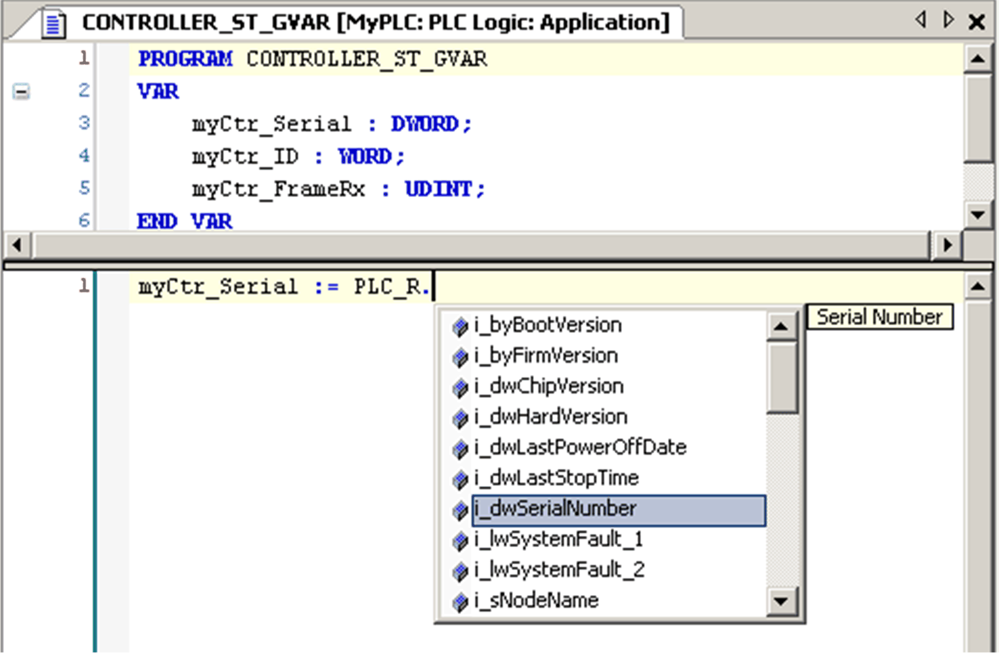

# Using System Variables

Using System Variables

Introduction

This section describes the steps required to [program](../glossary/glossary.htm#XREF_D_SE_0024697_749) and to use system variables in SoMachine.

System variables are global in scope, and you can use them in all the Program Organization Units (POUs) of the [application](../glossary/glossary.htm#XREF_D_SE_0024697_626).

System variables do not need to be declared in the Global Variable List ([GVL](../glossary/glossary.htm#XREF_D_SE_0024697_137)). They are automatically declared from the [controller](../glossary/glossary.htm#XREF_D_SE_0024697_661) system library.

Using System Variables in a POU

SoMachine has an auto-completion feature. In a POU, start by entering the system variable structure name (PLC\_R, PLC\_W...) followed by a dot. The system variables appear in the Input Assistant. You can select the desired variable or enter the full name manually.

NOTE: In the example above, after you type the structure name PLC\_R., SoMachine offers a pop-up menu of possible component names/variables.

Example

The following example shows the use of some system variables:

VAR  
    myCtr\_Serial : DWORD;  
    myCtr\_ID : WORD;  
    myCtr\_FramesRx : UDINT;  
END\_VAR

myCtr\_Serial := PLC\_R.i\_dwSerialNumber;  
myCtr\_ID := PLC\_R.i\_wVendorID;  
myCtr\_FramesRx := SERIAL\_R[0].i\_udiFramesReceivedOK;

EIO0000001246.03

© 2016 Schneider Electric. All rights reserved.