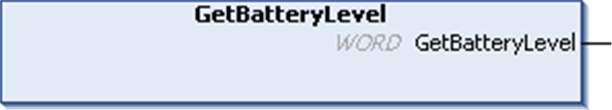

# GetBatteryLevel: Returns Remaining Power Charge of the Battery

GetBatteryLevel: Returns Remaining Power Charge of the Battery

Function Description

This function returns the remaining power charge of the external backup battery (in percent).

For more information about internal and external batteries, refer to the [HMI SCU Hardware Guide](../../../../../../api/crossBook?lang=en-US&virtualBookName=SCUhw&topicID=D_SE_0024639_5).

NOTE: This information is also available through the System Variable [PLC\_R.i\_wBatteryStatus](../HMI_SCU_PLC_SYS_Library_CHAP_SYSTEM_VAR/HMI_SCU_PLC_SYS_Library_CHAP_SYSTEM_VAR-6.htm#XREF_D_SE_0029062_1)

Graphical Representation

IL and ST Representation

To see the general representation in IL or ST language, refer to the chapter [Function and Function Block Representation](../Function_and_Function_Block_Representation/Function_and_Function_Block_Representation-1.htm#XREF_D_SE_0002384_1).

I/O Variables Description

The table describes the output variable:

| Output | Type | Comment |
| --- | --- | --- |
| GetBatteryLevel | WORD | Percentage of charge remaining in the battery.  Range: 0...100:  o100%= 3 V  o50% = 2.5 V  o0%= 2 V  NOTE: On the HMI controller a Battery Level is low message will be displayed if the voltage ≤ 2.5 Volts. |

EIO0000001246.03

© 2016 Schneider Electric. All rights reserved.