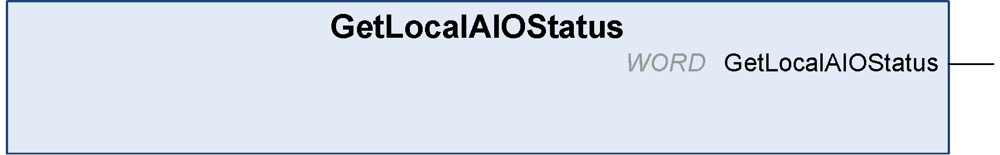

# GetLocalAIOStatus: Returns the Embedded Analog I/O Status

GetLocalAIOStatus: Returns the Embedded Analog I/O Status

Function Description

This function returns the status of the local input and outputs.

Graphical Representation

IL and ST Representation

To see the general representation in IL or ST language, refer to the chapter [Function and Function Block Representation](../Function_and_Function_Block_Representation/Function_and_Function_Block_Representation-1.htm#XREF_D_SE_0002384_1).

I/O Variable Description

The table describes the output variable:

| Bit | Description |
| --- | --- |
| 0 | Analog input 0 with configuration detected error. |
| 1 | Analog input 0 with current out of range. |
| 2 | Analog input 0 with invalid data. |
| 3 | Analog input 0 with broken wire (only available when input range is 4-20 mA). |
| 4 | Analog input 1 with configuration detected error. |
| 5 | Analog input 1 with current out of range. |
| 6 | Analog input 1 with invalid data. |
| 7 | Analog input 1 with broken wire (only available when input range is 4-20 mA). |
| 8 | Analog output 0 with configuration detected error. |
| 9 | Analog output 0 with voltage or current out of range. |
| 10 | Analog output 0 with invalid data. |
| 11 | Analog output 0 with detected error. |
| 12 | Analog output 1 with configuration detected error. |
| 13 | Analog output 1 with voltage or current out of range. |
| 14 | Analog output 1 with invalid data. |
| 15 | Analog output 1 with detected error. |

EIO0000001246.03

© 2016 Schneider Electric. All rights reserved.