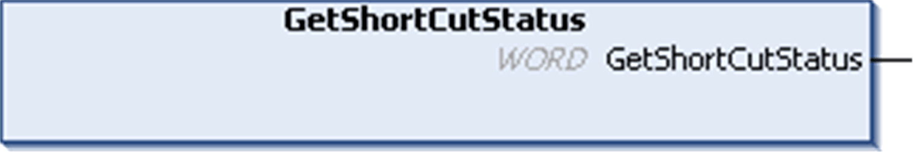

# GetShortCutStatus: Returns the Short-Circuit Status on Embedded Outputs

GetShortCutStatus: Returns the Short-Circuit Status on Embedded Outputs

Function Description

This function returns the short-circuit or overload diagnostic on embedded outputs.

NOTE: For more information about embedded outputs management, refer to the [HMI SCU Hardware Guide](../../../../../../api/crossBook?lang=en-US&virtualBookName=SCUhw&topicID=D_SE_0024639_5).

Graphical Representation

IL and ST Representation

To see the general representation in IL or ST language, refer to the chapter [Function and Function Block Representation](../Function_and_Function_Block_Representation/Function_and_Function_Block_Representation-1.htm#XREF_D_SE_0002384_1).

I/O Variable Description

The table describes the output variable:

| Parameter | Type | Comment |
| --- | --- | --- |
| GetShortCutStatus | WORD | See bit field description below. |

The table describes the bit field for the controller:

| Bit | Description |
| --- | --- |
| 0 | TRUE = short-circuit on outputs (Q0 and Q1). |

EIO0000001246.03

© 2016 Schneider Electric. All rights reserved.