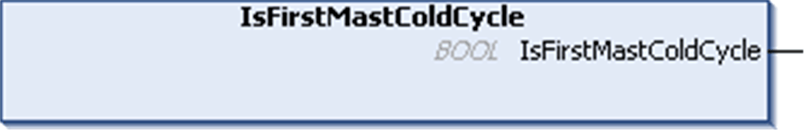

# IsFirstMastColdCycle: Indicates if Cycle is the First MAST Cold Start Cycle

IsFirstMastColdCycle: Indicates if Cycle is the First MAST Cold Start Cycle

Function Description

This function returns TRUE during the first [MAST](../glossary/glossary.htm#XREF_D_SE_0024697_150) cycle after a cold start (first cycle after download or reset cold).

Graphical Representation

IL and ST Representation

To see the general representation in IL or ST language, refer to the chapter [Function and Function Block Representation](../Function_and_Function_Block_Representation/Function_and_Function_Block_Representation-1.htm#XREF_D_SE_0002384_1).

I/O Variable Description

The table describes the output variable:

| Output | Type | Comment |
| --- | --- | --- |
| IsFirstMastColdCycle | BOOL | TRUE during the first MAST task cycle after a cold start. |

EIO0000001246.03

© 2016 Schneider Electric. All rights reserved.